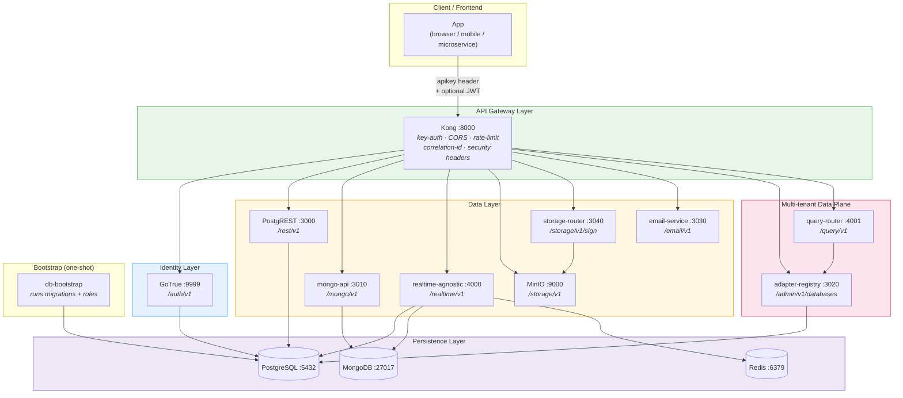
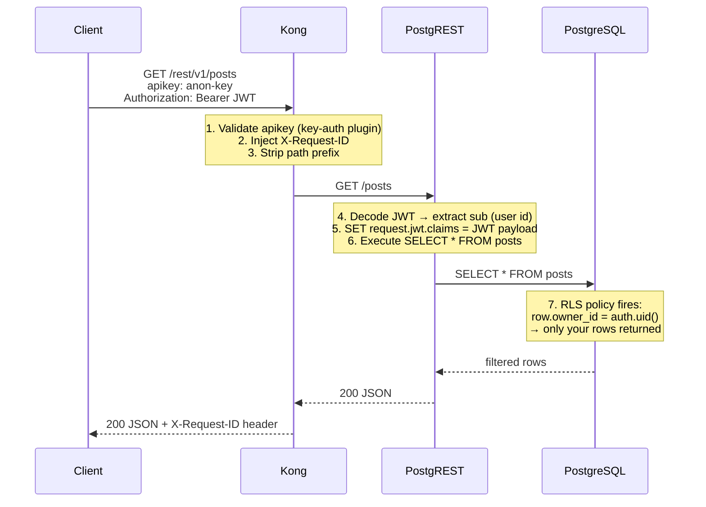
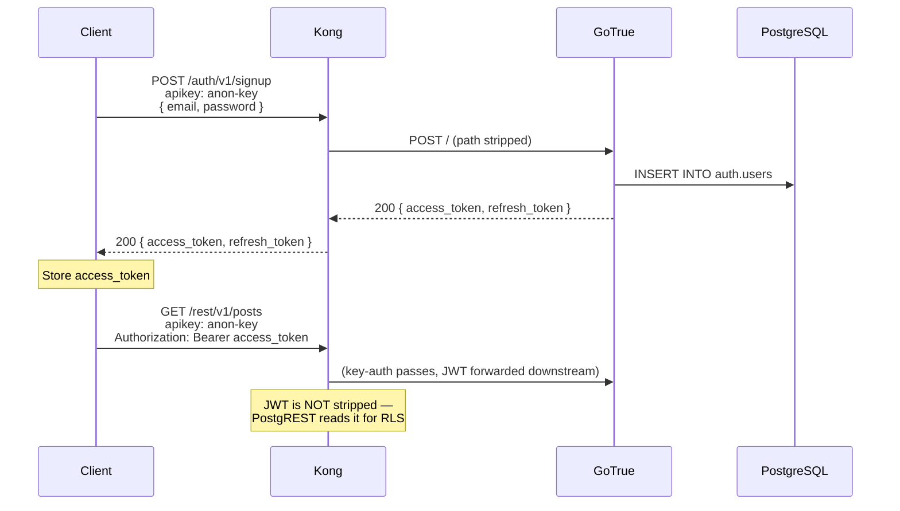
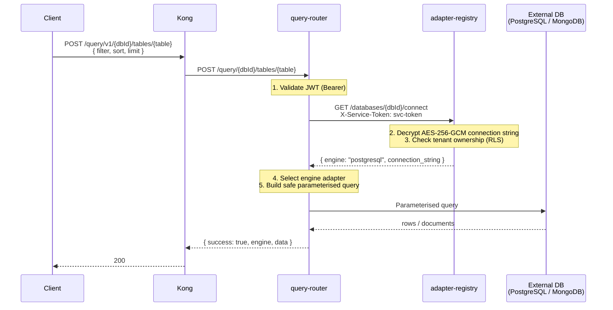
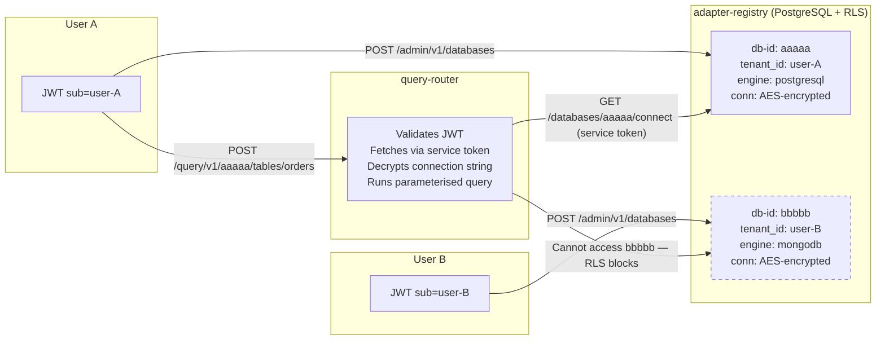
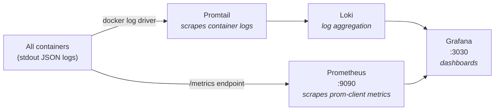
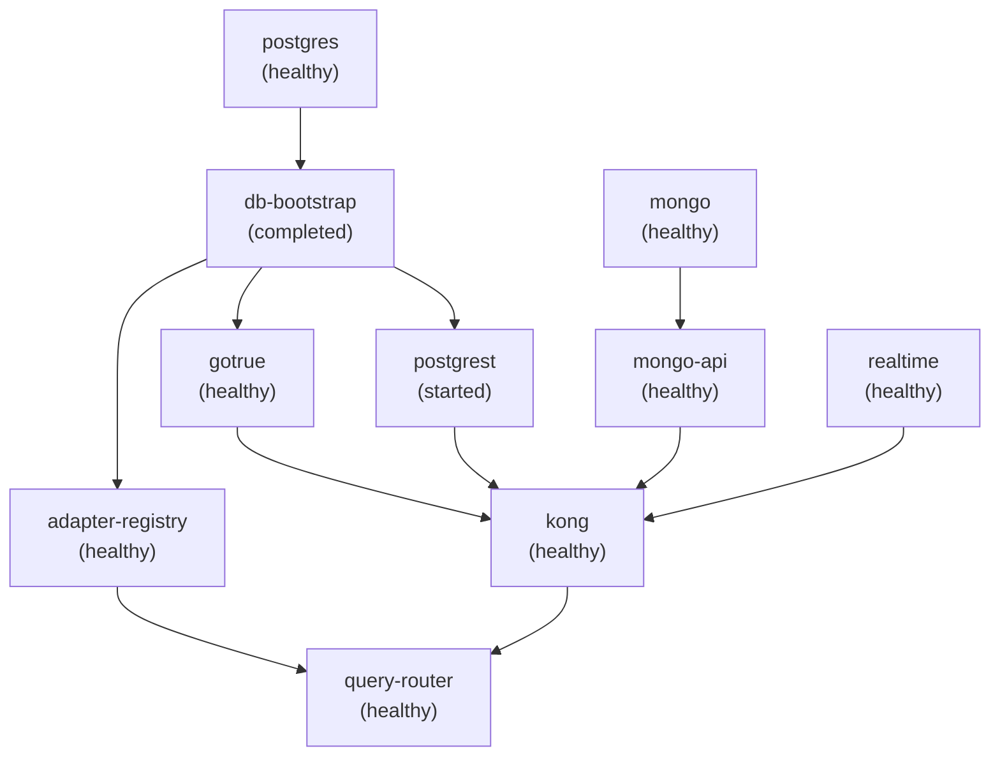

# mini-baas-infra

A self-hosted, Docker Compose–first **Backend as a Service** (BaaS) platform.

The intent is to provide a single stack that any frontend — or any set of microservices — can treat as a complete backend without writing server-side code. You get authentication, relational data, document data, realtime subscriptions, object storage, email, and a multi-tenant query plane, all behind one API gateway with a unified auth model.

---

## Table of contents

1. [Intent and goals](#1-intent-and-goals)
2. [Stack overview](#2-stack-overview)
3. [Full architecture diagram](#3-full-architecture-diagram)
4. [Request lifecycle](#4-request-lifecycle)
5. [Service-by-service breakdown](#5-service-by-service-breakdown)
6. [Auth and security model](#6-auth-and-security-model)
7. [Data plane patterns](#7-data-plane-patterns)
8. [Multi-tenant adapter pattern](#8-multi-tenant-adapter-pattern)
9. [Observability](#9-observability)
10. [Compose profiles](#10-compose-profiles)
11. [Quick start](#11-quick-start)
12. [Environment variables](#12-environment-variables)
13. [Project rules and conventions](#13-project-rules-and-conventions)

---

## 1. Intent and goals

### What this is

A production-ready backend platform that any application can consume via plain HTTP. The platform owns:

- **Identity** — sign up, log in, JWT issuance and validation
- **Relational data** — auto-generated REST API over PostgreSQL with row-level security
- **Document data** — REST API over MongoDB with owner-scoped isolation
- **Realtime** — WebSocket subscriptions watching PostgreSQL and MongoDB changes
- **Object storage** — S3-compatible file storage with presigned URL generation
- **Email** — transactional email dispatch
- **Multi-tenant external databases** — register and query any external PostgreSQL or MongoDB from a single endpoint

### What it is NOT

- A framework. There is no application code here, only infrastructure.
- Opinionated about your data model. PostgREST exposes whatever schema you put in PostgreSQL; the MongoDB service exposes any collection you address.
- A hosted service. Everything runs locally or on your own machines.

### Core design decisions

| Decision | Reason |
|---|---|
| Single internal Docker network | All services communicate by name, no exposed ports unless explicitly needed |
| One gateway for all HTTP traffic | Kong is the only ingress; clients talk to Kong, never to upstream services directly |
| DB-less Kong (declarative YAML) | No database dependency for the gateway; config is rendered at container start from a template |
| JWT shared secret | GoTrue issues JWTs; every service validates the same `JWT_SECRET`; no OAuth server needed |
| Two API keys (anon + service_role) | Public frontend key is safe to expose; service key is for internal M2M calls only |
| RLS enforced at the database | PostgreSQL row-level security uses `auth.uid()` extracted from the request JWT — the app layer cannot bypass it |
| Owner-id pattern in MongoDB | The API layer auto-injects `owner_id` from the JWT on write and enforces it on read/update/delete |
| AES-256-GCM for stored credentials | Connection strings in the Adapter Registry are encrypted at rest with scrypt key derivation |

---

## 2. Stack overview

```
Layer               │ Component            │ Upstream Image / Build
────────────────────┼──────────────────────┼──────────────────────────────────────
Gateway             │ Kong                 │ kong:3.8
Auth                │ GoTrue               │ supabase/gotrue:v2.188.1
SQL REST            │ PostgREST            │ postgrest/postgrest:v12.2.3
SQL DB              │ PostgreSQL           │ postgres:16-alpine
Document REST       │ mongo-api (custom)   │ ./docker/services/mongo-api
Document DB         │ MongoDB              │ mongo:7
Realtime            │ realtime-agnostic    │ dlesieur/realtime-agnostic:latest
Cache               │ Redis                │ redis:7-alpine
Object storage      │ MinIO                │ minio/minio (extras profile)
Storage signing     │ storage-router       │ ./docker/services/storage-router (extras)
Email               │ email-service        │ ./docker/services/email-service
Adapter Registry    │ adapter-registry     │ ./docker/services/adapter-registry
Query Router        │ query-router         │ ./docker/services/query-router
DB bootstrap        │ db-bootstrap (job)   │ postgres:16-alpine (one-shot SQL runner)
── extras ──────────┼──────────────────────┼──────────────────────────────────────
SQL federation      │ Trino                │ trinodb/trino:467 (extras)
Admin UI            │ Studio               │ supabase/studio (extras)
Metadata API        │ pg-meta              │ supabase/postgres-meta (extras)
Connection pooler   │ Supavisor            │ supabase/supavisor (extras)
── observability ───┼──────────────────────┼──────────────────────────────────────
Metrics             │ Prometheus           │ prom/prometheus (observability)
Dashboards          │ Grafana              │ grafana/grafana (observability)
Log aggregation     │ Loki + Promtail      │ grafana/loki + grafana/promtail (observability)
```

---

## 3. Full architecture diagram

### High-level topology



### Request flow — authenticated data read



### Auth flow — sign up → obtain JWT → use API



### Multi-tenant query plane



---

## 4. Request lifecycle

Every single request through the platform follows the same lifecycle:

```
Client sends request
  │
  ▼
Kong receives on :8000
  ├─ (1) key-auth plugin: validates apikey header
  │       → rejects with 401 if missing or unknown
  ├─ (2) correlation-id plugin: injects / propagates X-Request-ID header
  ├─ (3) cors plugin: validates Origin, adds CORS headers
  ├─ (4) rate-limiting plugin: per-IP, per-minute + per-hour limits
  ├─ (5) response-transformer: adds security headers (HSTS, X-Frame-Options …)
  ├─ (6) Matches route path → strips prefix → forwards to upstream service
  │
  ▼
Upstream service (GoTrue / PostgREST / mongo-api / …)
  ├─ (7) Reads X-Request-ID for structured logging (pino)
  ├─ (8) Validates JWT Bearer token (if route requires authentication)
  │       → checks signature against shared JWT_SECRET
  │       → extracts sub (user id) and role (anon / authenticated)
  ├─ (9) Executes business logic
  ├─ (10) Database enforces data isolation (RLS / owner_id filter)
  │
  ▼
Response flows back through Kong → Client
  └─ All security response headers already attached
```

**Two levels of auth** are always enforced separately and independently:

| Level | Mechanism | Validated by |
|---|---|---|
| Gateway access | `apikey` header | Kong key-auth plugin |
| Data ownership | `Authorization: Bearer JWT` | Individual upstream services + PostgreSQL RLS |

A request with a valid `apikey` but no JWT can reach public read endpoints (e.g., `GET /rest/v1/animals` with anon RLS policy). A request with an invalid JWT is always rejected by the upstream before hitting the database.

---

## 5. Service-by-service breakdown

### Kong — API Gateway

| Property | Value |
|---|---|
| Port (host) | `${KONG_HTTP_PORT}` (default `8000`) |
| Admin API | `127.0.0.1:8001` (local only) |
| Mode | DB-less declarative (`kong.yml`) |
| Config rendered | At container start via `sed` substitution of env vars |

Kong is the **only** entry point. Clients must never call upstream services directly. Kong enforces:

- `apikey` validation for every route (two consumers: `anon`, `service_role`)
- Per-route rate limits (auth: 60 req/min, REST: 180 req/min, query: 300 req/min, …)
- CORS with an explicit allowlist (wildcard disabled when `credentials: true`)
- `X-Request-ID` correlation header (UUID, echoed downstream)
- Security response headers (HSTS, nosniff, X-Frame-Options, Referrer-Policy)

### GoTrue — Authentication

| Property | Value |
|---|---|
| Kong path | `/auth/v1` |
| Upstream | `gotrue:9999` |
| JWT expiry | 3 600 s (1 hour) |

GoTrue (by Supabase) manages the full identity lifecycle: signup, login, JWT issuance, refresh, password recovery, email confirmation. It stores users in the `auth` schema on PostgreSQL.

The JWT payload includes `sub` (user UUID), `role` (anon / authenticated), and optionally `user_metadata` for app-specific claims. Every downstream service uses the same `JWT_SECRET` to verify these tokens without any service-to-service call.

### PostgREST — PostgreSQL REST API

| Property | Value |
|---|---|
| Kong path | `/rest/v1` |
| Upstream | `postgrest:3000` |
| Schema | `public` |

PostgREST automatically generates a full REST API from the PostgreSQL `public` schema. It reads the JWT, sets `request.jwt.claims` as a PostgreSQL session variable, and lets row-level security policies evaluate `auth.uid()` to enforce data isolation. No code needed for CRUD — define your schema and RLS, and you get a REST API instantly.

### mongo-api — MongoDB REST API (custom service)

| Property | Value |
|---|---|
| Kong path | `/mongo/v1` |
| Upstream | `mongo-api:3010` |
| Max body | 256 KB |

A custom Node.js/Express service that provides a REST interface to MongoDB. It mirrors the PostgREST ownership pattern: on every write, `owner_id` is set to the JWT's `sub` claim server-side. On every read, update, and delete, the query is automatically scoped to `{ owner_id: req.user.id }`. Clients cannot read or modify another user's documents even if they know the document `_id`.

**Response envelope** (always):
```json
{
  "success": true,
  "data": { },
  "error": null,
  "meta": { "request_id": "uuid", "pagination": { "limit": 20, "offset": 0, "total": 100 } }
}
```

### realtime-agnostic — Realtime WebSocket

| Property | Value |
|---|---|
| Kong path | `/realtime/v1` |
| Upstream | `realtime:4000/v1` |
| Supports | WebSocket upgrades |

A custom Rust-based service (`dlesieur/realtime-agnostic`) that provides WebSocket subscriptions over PostgreSQL logical replication and MongoDB change streams. Clients subscribe using a valid JWT; the service enforces the same identity model as the rest of the stack.

### adapter-registry — External Database Credential Store

| Property | Value |
|---|---|
| Kong path | `/admin/v1/databases` |
| Upstream | `adapter-registry:3020` |
| Internal-only path | via service token |

Stores encrypted connection strings for external databases. Each record is scoped to a `tenant_id` (the user's JWT `sub`). Connection strings are encrypted with AES-256-GCM using a key derived from `VAULT_ENC_KEY` via scrypt — they are never returned to clients in plaintext. The adapter-registry uses PostgreSQL RLS (`tenant_databases`) to ensure users can only see their own registrations.

Supported engines: `postgresql`, `mongodb`, `mysql`, `redis`, `sqlite`.

### query-router — Universal Query Plane

| Property | Value |
|---|---|
| Kong path | `/query/v1` |
| Upstream | `query-router:4001` |

The query-router bridges authenticated clients to their externally registered databases. On every request:

1. Validates the caller's JWT
2. Calls adapter-registry (using an internal `ADAPTER_REGISTRY_SERVICE_TOKEN`) to fetch and decrypt the target database's connection string
3. Selects the right engine adapter (PostgreSQL or MongoDB)
4. Executes a safe **parameterised** query — all user-supplied filter values are bound as parameters, SQL column and table names are validated against strict allow-lists (`/^[a-zA-Z_]\w{0,63}$/`)
5. Returns a normalised `{ success, engine, data }` response

### email-service — Transactional Email

| Property | Value |
|---|---|
| Kong path | `/email/v1` |
| Upstream | `email-service:3030` |
| SMTP | Configurable (Mailpit in dev, any SMTP in prod) |

JWT-protected email dispatch service. Validates the caller's identity before sending.

### storage-router — Presigned URL Generator

| Property | Value |
|---|---|
| Kong path | `/storage/v1/sign` |
| Upstream | `storage-router:3040` |
| Profile | extras |

Generates time-limited S3 presigned URLs for MinIO. Validates the JWT, checks ownership, then returns a signed URL valid for `PRESIGN_EXPIRES_SECONDS` (default 1 hour). The client uses the URL to upload or download directly from MinIO without any proxy overhead.

### MinIO — Object Storage

| Property | Value |
|---|---|
| Kong path | `/storage/v1` |
| Upstream | `minio:9000` |
| Console | `minio:9001` (extras) |
| Profile | extras |

S3-compatible object storage. All client requests to `/storage/v1` route through Kong key-auth. For presigned operations, use `storage-router` instead.

### PostgreSQL — Relational Database

| Role | Details |
|---|---|
| Primary store | All application data |
| Auth store | `auth` schema used by GoTrue |
| Registry store | `tenant_databases` table for adapter-registry |
| Health check | `pg_isready` |
| Bootstrap | `db-bootstrap` runs once on first start |

The `db-bootstrap` container runs `scripts/db-bootstrap.sql` on first startup. It creates required roles (`anon`, `authenticated`, `supabase_admin`), the `auth` schema, the `auth.uid()` helper function, the `realtime` database, and the seed tables (`users`, `posts`, `projects`, etc.).

### Redis — Cache

Used by the realtime service for subscription state and message brokering. Also available for any service that needs ephemeral key-value storage.

### analytics-service — Event Tracking

| Property | Value |
|---|---|
| Kong path | `/analytics/v1` |
| Upstream | `analytics-service:3070` |
| Storage | MongoDB (TTL auto-cleanup) |

Tracks arbitrary events with optional user attribution. Provides aggregation stats and distinct event type listing. Events auto-expire after `ANALYTICS_RETENTION_DAYS` (default 90).

### gdpr-service — Privacy & Compliance

| Property | Value |
|---|---|
| Kong path | `/gdpr/v1` |
| Upstream | `gdpr-service:3080` |
| Storage | PostgreSQL (RLS-enforced) |

Manages user consent records, data deletion requests (with status machine), and data export. Uses webhooks (`GDPR_DELETION_WEBHOOK_URL`, `GDPR_EXPORT_WEBHOOK_URL`) so consuming apps handle domain-specific logic.

### newsletter-service — Email Subscriptions

| Property | Value |
|---|---|
| Kong path | `/newsletter/v1` |
| Upstream | `newsletter-service:3090` |
| Storage | PostgreSQL |

Double opt-in subscription management and batch campaign sending. Delegates email delivery to the existing `email-service` via internal HTTP.

### ai-service — LLM Conversation Engine

| Property | Value |
|---|---|
| Kong path | `/ai/v1` |
| Upstream | `ai-service:3100` |
| Storage | MongoDB (conversations with TTL) |

Multi-turn chat with any OpenAI-compatible LLM (Groq, OpenAI, Ollama). **No hardcoded prompts** — consuming apps register prompt "modes" via admin API and inject domain context per-request.

### log-service — Centralized Log Streaming

| Property | Value |
|---|---|
| Kong path | `/logs/v1` |
| Upstream | `log-service:3110` |
| Storage | In-memory ring buffer |

Accepts structured log ingestion from any service. Provides real-time SSE streaming for admin dashboards and queryable buffered logs.

### session-service — Session Lifecycle

| Property | Value |
|---|---|
| Kong path | `/sessions/v1` |
| Upstream | `session-service:3120` |
| Storage | PostgreSQL (RLS-enforced) |

Token-based session management with create/validate/extend/revoke lifecycle. Admin endpoints for force-revocation, cleanup, and statistics.

> **Full API reference** for all new services: see [`docs/NEW_SERVICES.md`](docs/NEW_SERVICES.md)

---

## 6. Auth and security model

### Key hierarchy

```
JWT_SECRET  (shared among ALL services + database)
    │
    ├─► GoTrue issues JWT access tokens (HS256, exp 1h)
    ├─► PostgREST verifies JWT → sets session var for RLS
    ├─► mongo-api verifies JWT → scopes queries by sub
    ├─► query-router verifies JWT → passes sub to registry
    ├─► adapter-registry verifies JWT → enforces tenant ownership
    ├─► email-service verifies JWT → authorises dispatch
    └─► storage-router verifies JWT → authorises presign

KONG_PUBLIC_API_KEY   → consumer: anon        (safe for frontend bundles)
KONG_SERVICE_API_KEY  → consumer: service_role (never exposed to clients)

ADAPTER_REGISTRY_SERVICE_TOKEN  → internal M2M: query-router → adapter-registry
VAULT_ENC_KEY                   → AES-256-GCM key derivation for stored credentials
```

### Two-key gateway pattern

Every HTTP client must present an `apikey` header to pass through Kong. This alone does not grant data access — it just grants access to the gateway. The two keys serve distinct roles:

- **`anon` key**: Included in every frontend JavaScript bundle. It is not a secret. It lets Kong route the request and identify the consumer for rate-limiting. It grants no elevated privileges.
- **`service_role` key**: Used only in server-side code or internal services. Never exposed to browsers.

### Row-level security (PostgreSQL)

The `db-bootstrap.sql` creates `auth.uid()`:

```sql
CREATE OR REPLACE FUNCTION auth.uid() RETURNS UUID AS $$
  SELECT (current_setting('request.jwt.claims', true)::jsonb->>'sub')::uuid;
$$ LANGUAGE SQL STABLE;
```

PostgREST sets `request.jwt.claims` to the full JWT payload before any query executes. RLS policies use `auth.uid()` to restrict rows:

```sql
-- Example policy: users see only their own rows
CREATE POLICY "owner isolation"
  ON public.posts
  USING (owner_id::text = auth.uid()::text);
```

This makes data isolation a database guarantee, not an application guarantee. Even a compromised upstream service cannot return another tenant's data.

### Owner-id pattern (MongoDB)

The mongo-api enforces the equivalent pattern for MongoDB:

```
POST /mongo/v1/collections/orders/documents
  → owner_id is ALWAYS set to req.user.id (from JWT)
  → client-supplied owner_id in body is ignored

GET /mongo/v1/collections/orders/documents
  → query is ALWAYS { owner_id: req.user.id }
  → client cannot add filter to override this
```

---

## 7. Data plane patterns

### PostgreSQL via PostgREST

PostgREST uses PostgREST's filter syntax directly over HTTP:

```
GET  /rest/v1/posts?select=id,title&is_public=eq.true
GET  /rest/v1/posts?id=eq.abc123
POST /rest/v1/posts        body: { title, content }
PATCH /rest/v1/posts?id=eq.abc123   body: { content }
DELETE /rest/v1/posts?id=eq.abc123
```

Headers always required:
```
apikey: <KONG_PUBLIC_API_KEY>
Authorization: Bearer <JWT>     ← required for RLS to know the caller
Content-Type: application/json
```

### MongoDB via mongo-api

```
POST   /mongo/v1/collections/:name/documents       create document
GET    /mongo/v1/collections/:name/documents       list documents (owner-scoped)
GET    /mongo/v1/collections/:name/documents/:id   get one document
PATCH  /mongo/v1/collections/:name/documents/:id   update (owner-scoped)
DELETE /mongo/v1/collections/:name/documents/:id   delete (owner-scoped)
```

Collection names must match `^[a-zA-Z0-9_-]{1,64}$`. Keys `_id` and `owner_id` are reserved and will be rejected on create/update.

### External databases via query-router

Register a database first:
```
POST /admin/v1/databases
{ "engine": "postgresql", "name": "my-analytics", "connection_string": "postgres://..." }
→ { "success": true, "data": { "id": "db-uuid", ... } }
```

Then query it:
```
POST /query/v1/{dbId}/tables/{tableName}
{ "filter": { "status": "active" }, "sort": "created_at:desc", "limit": 20, "offset": 0 }
```

The query-router builds a fully parameterised query — the `filter` values are always bound parameters, never interpolated into SQL. Column names are validated against `/^[a-zA-Z_]\w*$/`.

---

## 8. Multi-tenant adapter pattern



The adapter-registry table has a PostgreSQL RLS policy that enforces `tenant_id = current_setting('app.current_tenant')`. The query-router sets this session variable before any query. User A can never access User B's registered database, even if they know `bbbbb`'s UUID, because the registry's own RLS policy blocks the select.

---

## 9. Observability

Activate with `--profile observability`:



Every custom service (mongo-api, adapter-registry, query-router, email-service, storage-router) exposes:
- **Structured JSON logs** via `pino` — level, service name, version, ISO timestamp, `X-Request-ID`
- **Prometheus metrics** at `/metrics` via `prom-client`
- **Health endpoints** at `/health/live` (liveness) and `/health/ready` (readiness)

---

## 10. Compose profiles

```
docker compose up                               ← core stack only
docker compose --profile extras up              ← + Trino, Studio, pg-meta, MinIO, Supavisor, storage-router
docker compose --profile observability up       ← + Prometheus, Grafana, Loki, Promtail
docker compose --profile playground up          ← + static playground frontend on :3100
docker compose --profile extras --profile observability up   ← combine any profiles
```

### Core stack (no profile)

| Service | Internal port | Host port |
|---|---|---|
| Kong proxy | 8000 | `8000` (or `KONG_HTTP_PORT`) |
| Kong admin | 8001 | `127.0.0.1:8001` |
| PostgreSQL | 5432 | `5432` (or `PG_PORT`) |
| MongoDB | 27017 | `27017` (or `MONGO_PORT`) |
| Redis | 6379 | `6379` (or `REDIS_PORT`) |

All other services are internal-only (no host port).

### Startup order (enforced by `depends_on` + healthchecks)



---

## 11. Quick start

### Prerequisites

- Docker Engine ≥ 24
- Docker Compose v2 plugin
- `make`
- A `.env` file (copy `.env.example` and fill in secrets)

```bash
cp .env.example .env
# edit .env — at minimum set JWT_SECRET, VAULT_ENC_KEY, ADAPTER_REGISTRY_SERVICE_TOKEN
```

### Start the core stack

```bash
make up
# or: make all   (pulls images first, then starts)
```

### Start the full stack (all extras)

```bash
make all-full
# or: docker compose --profile extras up -d
```

### Start with observability

```bash
docker compose --profile observability up -d
# Grafana: http://localhost:3030
# Prometheus: http://localhost:9090
```

### Common make targets

```
make up           Start stack (detached)
make down         Stop stack
make re           Full reset: fclean + all
make fclean       Remove containers, volumes, and images
make build        Build/pull all images
make logs         Follow all logs
make logs SERVICE=kong   Follow logs of one service
make ps           Show container status
make health       Check all healthchecks
make test-smoke   Run smoke tests (scripts/phase1-smoke-test.sh)
make help         List all targets
```

### Verify the stack is up

```bash
# Kong health (should return 200)
curl -s http://localhost:8000/auth/v1/health -H "apikey: public-anon-key" | jq .

# Sign up a user
curl -s -X POST http://localhost:8000/auth/v1/signup \
  -H "apikey: public-anon-key" \
  -H "Content-Type: application/json" \
  -d '{"email":"dev@example.com","password":"changeme123"}' | jq .

# Query the REST API (with JWT from above)
curl -s http://localhost:8000/rest/v1/users \
  -H "apikey: public-anon-key" \
  -H "Authorization: Bearer <access_token>" | jq .

# Create a MongoDB document
curl -s -X POST http://localhost:8000/mongo/v1/collections/notes/documents \
  -H "apikey: public-anon-key" \
  -H "Authorization: Bearer <access_token>" \
  -H "Content-Type: application/json" \
  -d '{"title":"my first note","body":"hello world"}' | jq .
```

---

## 12. Environment variables

Below are the critical variables. See `.env.example` for the complete list.

| Variable | Required | Description |
|---|---|---|
| `JWT_SECRET` | **yes** | Shared HS256 secret — GoTrue issues tokens, all services verify them |
| `VAULT_ENC_KEY` | **yes** | 32-char key for AES-256-GCM encryption of stored connection strings |
| `ADAPTER_REGISTRY_SERVICE_TOKEN` | **yes** | Internal M2M bearer token: query-router → adapter-registry |
| `KONG_PUBLIC_API_KEY` | **yes** | The `anon` consumer key (safe to put in frontend code) |
| `KONG_SERVICE_API_KEY` | **yes** | The `service_role` consumer key (backend only) |
| `POSTGRES_PASSWORD` | **yes** | PostgreSQL superuser password |
| `MONGO_INITDB_ROOT_PASSWORD` | **yes** | MongoDB root password |
| `KONG_HTTP_PORT` | no | Kong proxy host port (default `8000`) |
| `KONG_ADMIN_PORT` | no | Kong admin host port (default `8001`) |
| `PG_PORT` | no | PostgreSQL host port (default `5432`) |
| `MONGO_PORT` | no | MongoDB host port (default `27017`) |
| `REDIS_PORT` | no | Redis host port (default `6379`) |
| `GOTRUE_MAILER_AUTOCONFIRM` | no | `true` in dev to skip email confirmation (default `true`) |
| `LOG_LEVEL` | no | Log verbosity for custom services: `debug`/`info`/`warn`/`error` (default `info`) |
| `KONG_CORS_ORIGIN_APP` | no | Allowed CORS origin for the app frontend |
| `KONG_CORS_ORIGIN_PLAYGROUND` | no | Allowed CORS origin for the playground |

Secrets must never be committed. Use `scripts/generate-env.sh` to generate a `.env` with safe random values for local dev.

---

## 13. Project rules and conventions

These rules are enforced across every custom service and are the standard all contributors must follow.

### Service structure (Node.js custom services)

Every custom service follows the same layout:

```
src/
  server.js           ← express app + lifecycle (startup, graceful shutdown)
  routes/
    health.js         ← /health/live + /health/ready
    <domain>.js       ← business routes
  middleware/
    auth.js           ← JWT validation middleware
    correlationId.js  ← X-Request-ID propagation
    errorHandler.js   ← centralised error response
  lib/
    db.js             ← database connection pool
    crypto.js         ← if storing secrets
```

### Mandatory for every service

- **Environment validation at startup** — check all required env vars with `process.exit(1)` if missing
- **Structured JSON logging** via `pino` with `{ service, version }` base fields and ISO timestamps
- **`X-Request-ID` propagation** — read from incoming request, set on response, pass to all outgoing internal calls
- **Prometheus metrics endpoint** at `/metrics` via `prom-client`
- **Health endpoints** — `/health/live` (process alive) and `/health/ready` (dependencies connected)
- **Graceful shutdown** — handle `SIGTERM` and `SIGINT`, drain connections, exit 0

### Security rules

- All user-controlled input that forms part of a SQL query must use **bind parameters**
- Column and table names from request params are validated against `^[a-zA-Z_]\w{0,63}$` — never interpolated directly
- Connection strings stored in adapter-registry are **always encrypted** before persistence (AES-256-GCM + scrypt)
- `owner_id` in MongoDB documents is **always server-injected** from the JWT — client-supplied values are stripped
- The `service_role` API key and `ADAPTER_REGISTRY_SERVICE_TOKEN` are **never** passed to frontend code
- JWT verification always specifies `{ algorithms: ['HS256'] }` explicitly — never trusts the JWT header's `alg` claim

### Response envelope contract

All custom API services return JSON in one of two forms:

```json
{ "success": true,  "data": { } }
{ "success": false, "error": { "code": "snake_case_code", "message": "Human readable message" } }
```

`error.code` is a stable machine-readable identifier clients can `switch` on. `message` is for humans and may change.

### Health check contract

```
GET /health/live   → 200 { status: "ok" }          (always, if process is running)
GET /health/ready  → 200 { status: "ok" }          (only if all dependencies are up)
                   → 503 { status: "degraded", details: [...] }
```

Docker healthchecks are configured on all services using `/health/live`.

### Dependency startup order

Services must not assume their dependencies are ready at process start. All custom services use retry loops or connection pools with built-in reconnect. The `depends_on` + `condition: service_healthy` in `docker-compose.yml` is a best-effort guard; it does not replace defensive startup code.

### Makefile targets follow the 42 convention

The classic `all` / `clean` / `fclean` / `re` pattern is preserved at the top level. New targets go into labelled sections (`##@`) to appear correctly in `make help`.

---

## Directory reference

```
mini-baas-infra/
├── docker-compose.yml          ← single source of truth for service topology
├── docker-compose.prod.yml     ← production overrides
├── docker-compose.ci.yml       ← CI overrides
├── Makefile                    ← all lifecycle commands
├── .env.example                ← template for environment secrets
├── scripts/
│   ├── db-bootstrap.sql        ← one-shot PostgreSQL schema + roles setup
│   ├── generate-env.sh         ← generate a .env with random secrets
│   ├── resolve-ports.sh        ← detect port conflicts, remap if needed
│   ├── phase1-smoke-test.sh    ← basic API reachability test
│   └── phase{2-15}-*.sh        ← progressive integration test suite
├── docker/
│   ├── services/
│   │   ├── kong/conf/kong.yml  ← declarative gateway config (template)
│   │   ├── mongo-api/          ← custom MongoDB REST service
│   │   ├── adapter-registry/   ← external DB credential vault
│   │   ├── query-router/       ← universal query plane
│   │   ├── email-service/      ← SMTP dispatcher
│   │   ├── storage-router/     ← presigned URL generator
│   │   └── realtime/           ← Dockerfile wrapper for realtime image
│   └── contracts/              ← API contracts per service
├── config/
│   ├── prometheus/             ← Prometheus scrape config
│   ├── grafana/provisioning/   ← Grafana datasource + dashboard provisioning
│   ├── loki/                   ← Loki config
│   └── promtail/               ← Promtail scrape config
├── sandbox/
│   └── apps/app2/              ← Example app (Savanna Park Zoo) using the BaaS
└── docs/                       ← Architecture notes, runbooks, endpoint specs
```
