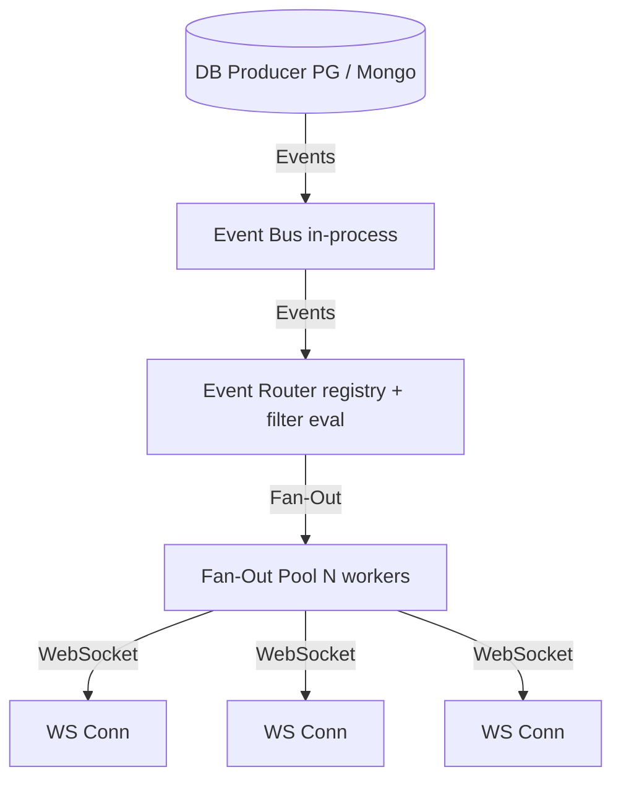

# Realtime Agnostic

## Purpose
A database-agnostic, horizontally scalable, Rust-native realtime event routing engine.

## Expectations
We expect them to route events from databases to clients in real-time.

## Relations with other modules
It orchestrates all crate modules (`realtime-core`, `realtime-engine`, etc.).

## How to use them technically
```bash
cargo build --workspace
cargo run --bin realtime-server
```

## Context of use
Used as the main server and workspace root for the realtime event router.

## Architecture


