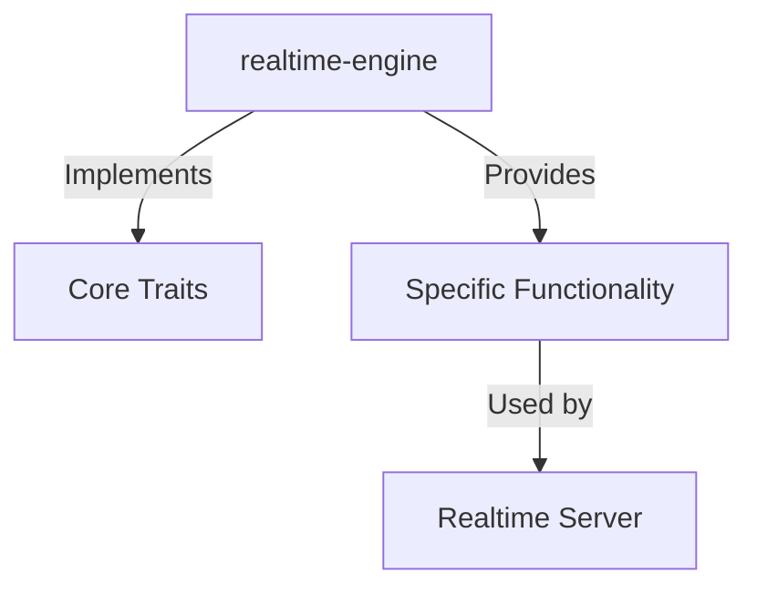

# realtime-engine

## Purpose
This module provides the realtime-engine functionality for the realtime-agnostic platform.

## Expectations
We expect this module to handle its specific domain responsibilities efficiently, reliably, and consistently without leaking abstractions to other modules.

## Relations with other modules
It interacts with core components such as `realtime-core` for shared types and traits, and may be utilized by `realtime-server` or `realtime-gateway` to integrate its capabilities into the main application flow.

## How to use them technically
```rust
// Add to Cargo.toml
// [dependencies]
// realtime-engine = { path = "../realtime-engine" }

// Example usage
// use realtime-engine::*;
```

## Context of use
This module is used within the broader context of the database-agnostic realtime event routing engine, typically invoked during the server lifecycle or event processing pipeline.

## Architecture


