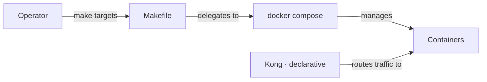

# Docker Best Practices

This chapter codifies the operational conventions that govern how containers are built, run, and maintained within the mini-baas stack. Every rule below exists because it prevents a class of failure observed in practice.

---

## Table of Contents

- [Operating Model](#operating-model)
- [Daily Workflow](#daily-workflow)
- [Image Management](#image-management)
- [Kong Configuration Discipline](#kong-configuration-discipline)
- [Compose and Container Hygiene](#compose-and-container-hygiene)
- [Security and Secrets](#security-and-secrets)
- [Testing and CI](#testing-and-ci)
- [Troubleshooting Patterns](#troubleshooting-patterns)
- [Readiness Checklist](#readiness-checklist)

---

## Operating Model

The stack follows a **Compose-first** philosophy. Every service is orchestrated through `docker-compose.yml`, and all operator actions flow through Make targets defined in the root `Makefile`. Kong, the sole ingress point, is configured declaratively from `docker/services/kong/conf/kong.yml`.



There is no imperative container management. If a task cannot be expressed as a Make target, it belongs in a debugging session, not in an automated workflow.

---

## Daily Workflow

The standard operating sequence for a development session:

| Step | Command | Purpose |
|------|---------|---------|
| 1 | `make baas` | Bring the full BaaS stack up |
| 2 | `make compose-ps` | Verify all containers are healthy |
| 3 | `make compose-logs SERVICE=<name>` | Inspect a specific service |
| 4 | `make tests` | Run integration test phases 1–13 |
| 5 | `make turn-off` | Shut everything down cleanly |

**Key principles:**

1. Always generate `.env` before the first run: `bash scripts/generate-env.sh`.
2. Use `make compose-down-volumes` before any credential reset to flush stale database state.
3. Reserve raw `docker compose` commands for interactive debugging only — never in automation.

---

## Image Management

| Practice | Rationale |
|----------|-----------|
| Pin explicit image tags via `IMAGE_TAG` when publishing | Prevents mutable-tag drift in release pipelines |
| Use `make docker-build` to normalize local names (`mini-baas/<service>:<tag>`) | Ensures consistent naming across developer machines |
| Use `make docker-tag` and `make docker-push` for registry workflows | Wraps tagging and pushing in a reproducible sequence |
| Never use `:latest` in production compose files | Eliminates silent version changes on pull |

---

## Kong Configuration Discipline

Kong operates in **database-off** (declarative) mode. The file `docker/services/kong/conf/kong.yml` is the single source of truth for all routing, authentication, and rate-limiting policy.

**Rules:**

1. **Validate before restart.** A syntax error in the declarative config breaks the entire gateway.

    ```bash
    docker run --rm -e KONG_DATABASE=off \
      -e KONG_DECLARATIVE_CONFIG=/tmp/kong.yml \
      -v "$PWD/docker/services/kong/conf/kong.yml:/tmp/kong.yml:ro" \
      kong:3.8 kong config parse /tmp/kong.yml
    ```

2. **Apply changes incrementally.** Routing first, then authentication plugins, then rate-limiting — one concern at a time.
3. **Re-test affected routes** after every plugin modification.
4. **Never edit the config inside a running container.** Changes are applied exclusively through the volume mount at startup.

---

## Compose and Container Hygiene

These rules keep the stack deterministic and debuggable:

| Convention | Detail |
|-----------|--------|
| Health checks and startup ordering | Every service that accepts connections declares a health check. Dependents use `depends_on` with `condition: service_healthy`. |
| Stable container names | All containers follow the `mini-baas-<service>` pattern for predictable log inspection and `exec` commands. |
| Read-only config mounts | Configuration files are mounted with `:ro`. Writable data goes to named volumes only. |
| Domain-separated volumes | Persistent data is isolated by service: `postgres-data`, `mongo-data`, `minio-data`, `redis-data`. No shared data volume exists. |

---

## Security and Secrets

| Rule | Detail |
|------|--------|
| Secrets live in `.env` and are never committed | `.gitignore` excludes `.env` at the root |
| Rotate JWT and service keys when sharing environments | `scripts/secrets/rotate-jwt.sh` handles rotation |
| Restrict CORS origins in non-local profiles | The global Kong CORS plugin defaults to `*` for development only |
| Treat static API keys as development-only defaults | `public-anon-key` and `service-role-key` must be regenerated for any shared deployment |

---

## Testing and CI

The integration gate is `make tests`, which executes phases 1 through 13 in sequence. Each phase tests a specific contract of the stack: routing, authentication, RLS enforcement, storage, rate limiting, CORS, and more.

**Conventions:**

- Shell scripts must pass `bash -n` (syntax check) and `shellcheck` before merge.
- On test failure, capture compose logs for the failing service immediately: `make compose-logs SERVICE=<name>`.
- Never weaken an assertion to make a test pass. A failing assertion indicates a problem in the stack, not in the test.

---

## Troubleshooting Patterns

### Auth flow fails after stack start

1. Verify `JWT_SECRET` alignment across GoTrue, PostgREST, and mongo-api.
2. Inspect GoTrue logs: `make compose-logs SERVICE=gotrue`.
3. Confirm Kong key-auth plugin returns 200 for valid API keys.

### Bootstrap errors after environment changes

Stop the stack, remove all volumes, and restart from a clean state:

```bash
make compose-down-volumes
make baas
```

This forces the database bootstrap container to re-execute with the current `db-bootstrap.sql`.

### Route mismatch errors

1. Re-validate `kong.yml` with the parse command shown above.
2. Confirm route paths in test scripts match the current declarative config.
3. Check `strip_path` behavior — if `true`, the upstream receives the path *without* the matched prefix.

---

## Readiness Checklist

Before considering the stack operational, verify every item:

- [ ] `make baas` succeeds without errors
- [ ] `make compose-ps` shows all expected containers as healthy
- [ ] `make tests` passes all phases
- [ ] `kong config parse` succeeds after any route or plugin edit
- [ ] Documentation reflects the current commands and route table
