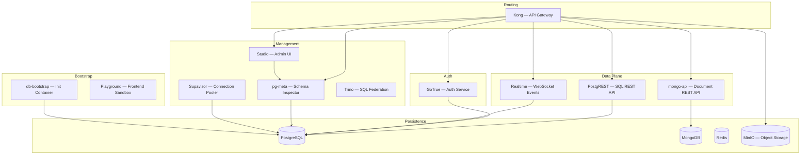

# Container Roles and Responsibilities

Every container in the mini-baas stack serves a single, well-defined purpose. This document maps each container to its role within the platform architecture. The groupings reflect the logical layers of a Backend-as-a-Service: routing, authentication, data, storage, management, and bootstrap.

---

## Architecture Overview

---

## Routing and API Gateway

| Container | Role |
|-----------|------|
| **kong** | Single entry point for all client traffic. Routes requests to upstream services based on path prefix, enforces API key authentication, applies rate limiting, and manages CORS policy. Configured declaratively — no database backend. |

---

## Authentication

| Container | Role |
|-----------|------|
| **gotrue** | Handles user registration, login, token issuance (JWT), and token refresh. Stores user credentials in the PostgreSQL `auth` schema. All JWTs are signed with a shared `JWT_SECRET` that downstream services use for verification. |

---

## Data Plane

| Container | Role |
|-----------|------|
| **postgrest** | Exposes PostgreSQL tables as a RESTful API. Validates incoming JWTs against the shared secret and maps the `sub` claim to a database role, enabling Row-Level Security at the database layer. |
| **mongo-api** | Custom Node.js service that provides JWT-protected CRUD operations over MongoDB collections. Injects `owner_id` from the JWT subject on every write and filters every read by `owner_id`, enforcing tenant isolation at the application layer. |
| **realtime** | Pushes database change events to connected clients over WebSocket. Listens to PostgreSQL logical replication and forwards row-level changes in real time. |

---

## Persistence

| Container | Role |
|-----------|------|
| **postgres** | Primary relational database. Stores application data, user accounts (via GoTrue's `auth` schema), and enforces Row-Level Security policies. |
| **mongo** | Document database for schemaless, user-isolated collections. Runs as a single-node replica set to support change streams. |
| **redis** | In-memory key-value store used for caching, session state, and low-latency coordination between services. |
| **minio** | S3-compatible object storage. Handles file uploads, bucket management, and presigned URL generation for the storage API. |

---

## Management and Developer Experience

| Container | Role |
|-----------|------|
| **pg-meta** | PostgreSQL metadata API. Exposes schema introspection endpoints consumed by Studio for table browsing and management. |
| **studio** | Web-based admin interface for database operations, user management, and project configuration. Connects to the stack through Kong. |
| **supavisor** | Connection pooler that sits between application services and PostgreSQL, managing session and transaction pooling for high-concurrency scenarios. |
| **trino** | Distributed SQL query engine for federated queries across heterogeneous data sources. Available in the `extras` Compose profile. |

---

## Bootstrap and Utility

| Container | Role |
|-----------|------|
| **db-bootstrap** | One-shot init container. Waits for PostgreSQL to become healthy, then executes `scripts/db-bootstrap.sql` to create roles (`anon`, `authenticated`, `supabase_admin`), schemas, tables, RLS policies, and seed data. Exits after completion. |
| **playground** | Nginx container serving the local frontend sandbox at port 3100. Provides a visual test surface for exercising the dual data-plane CRUD flows. |
