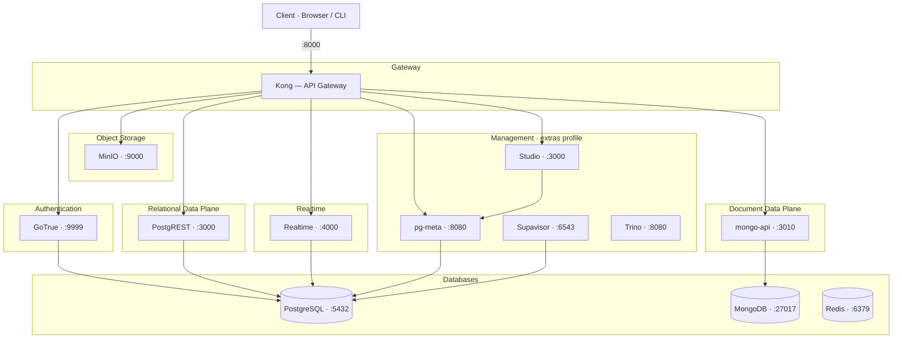
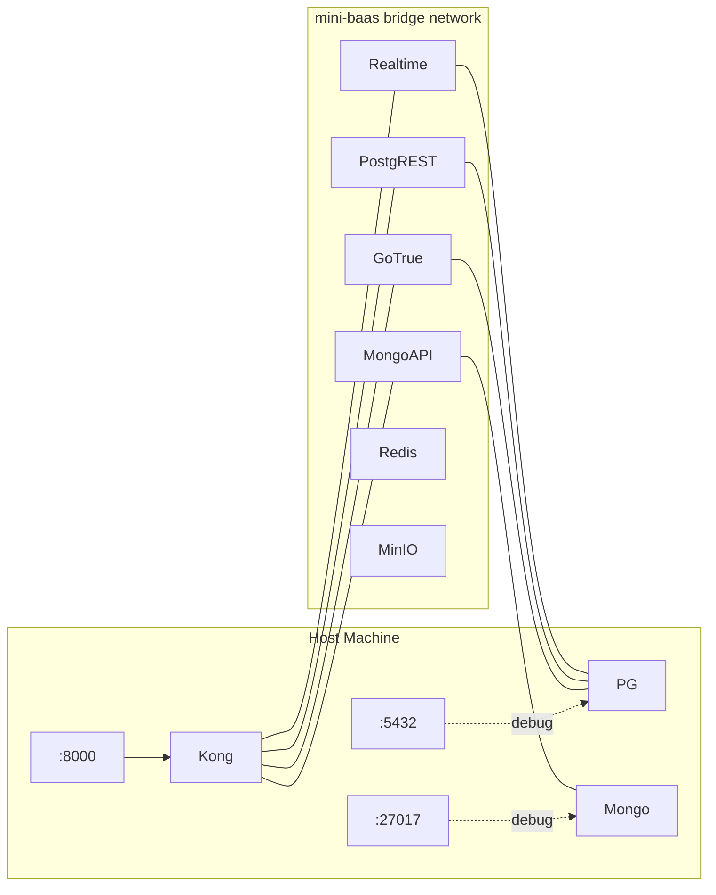
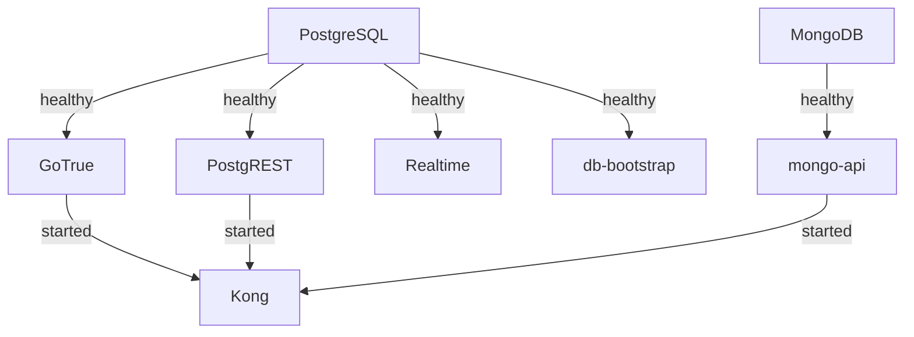

# Infrastructure Overview

This document describes the runtime topology, service composition, and operational model of the mini-baas infrastructure. It should be read as the architectural map of the system — every other document in this folder references the components described here.

---

## Table of Contents

- [Core Runtime](#core-runtime)
- [Service Topology](#service-topology)
- [Network Model](#network-model)
- [Compose Profiles](#compose-profiles)
- [Startup Order](#startup-order)
- [Operational Commands](#operational-commands)
- [Image Strategy](#image-strategy)

---

## Core Runtime

| Concern | Technology |
|---------|------------|
| Container runtime | Docker Engine |
| Service orchestration | Docker Compose |
| Network model | Single internal bridge (`mini-baas`) |
| Primary ingress | Kong API Gateway (`localhost:8000`) |
| Secret management | `.env` file, generated by `scripts/generate-env.sh` |

---

## Service Topology



---

## Network Model

All containers join a single Docker bridge network named `mini-baas`. Internal communication uses container hostnames (e.g., `postgres`, `gotrue`, `mongo-api`). Only Kong exposes a port to the host (`:8000`), with database ports optionally exposed for debugging.



---

## Compose Profiles

The stack is divided into profiles so developers load only the services they need:

| Profile | Services | Purpose |
|---------|----------|---------|
| **core** (default) | Kong, GoTrue, PostgREST, PostgreSQL, MongoDB, mongo-api, Realtime, Redis, db-bootstrap | Minimum viable BaaS |
| **extras** | Studio, pg-meta, Supavisor, Trino, MinIO, storage-router | Management UI, connection pooling, SQL federation, object storage |
| **observability** | Prometheus, Grafana, Loki, Promtail | Metrics, dashboards, and log aggregation |
| **playground** | playground (Nginx) | Frontend sandbox for demo and testing |

Activate a profile:

```bash
docker compose --profile extras --profile observability up -d
```

---

## Startup Order

Services declare health checks and `depends_on` conditions so that the stack boots in a safe sequence:



PostgreSQL and MongoDB must be healthy before any service that depends on them will start. Kong starts last because it needs its upstreams to be reachable.

---

## Operational Commands

| Action | Command |
|--------|---------|
| Start stack | `make baas` |
| Check status | `make compose-ps` |
| View logs | `make compose-logs` or `make compose-logs SERVICE=<name>` |
| Run tests | `make tests` |
| Stop stack | `make turn-off` |
| Full reset (destroy volumes) | `make compose-down-volumes` |
| Clean everything | `make fclean` |

---

## Image Strategy

- Prefer official, stable upstream images for infrastructure services (PostgreSQL 16, MongoDB 7, Redis 7, Kong 3.8).
- Custom services (mongo-api, query-router, adapter-registry, etc.) are built from lightweight Node.js base images.
- Keep image tags explicit via `IMAGE_TAG` for reproducible builds.
- Use `make build-and-push` when preparing images for a container registry.
