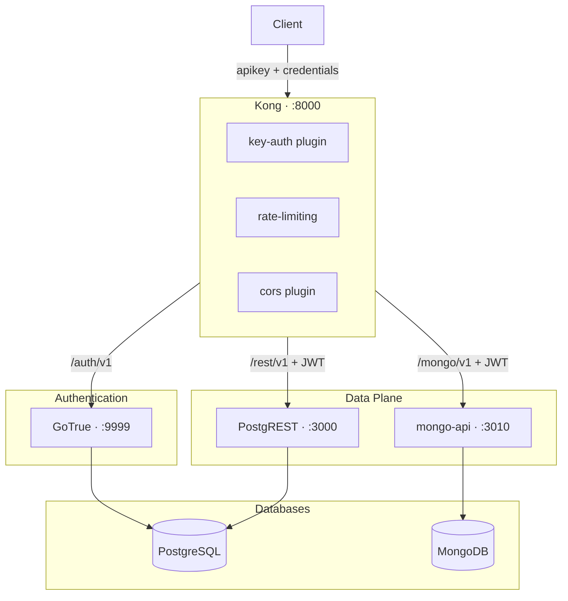
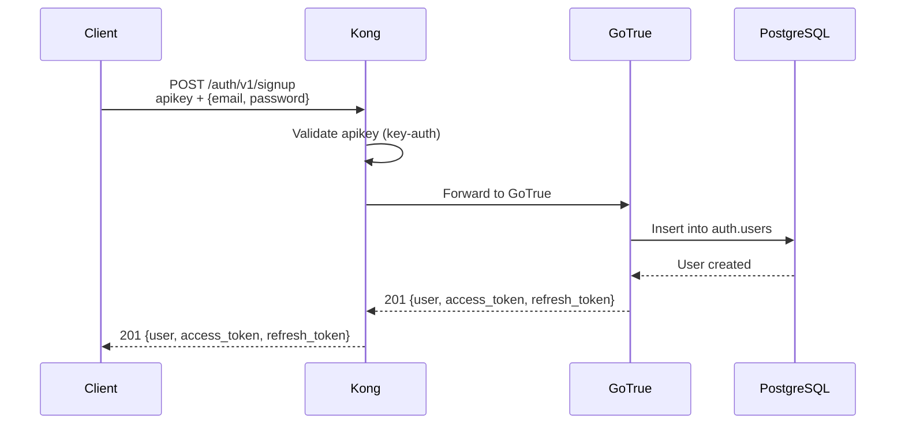
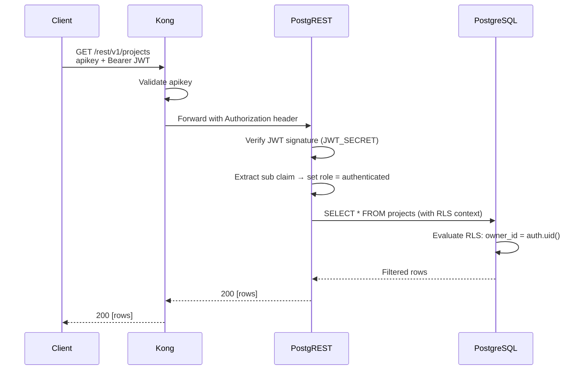

# Authentication Flow Through the Kong Gateway

This document explains how a client request travels from the browser through the API gateway, acquires a JWT, and uses that token to access data in PostgreSQL and MongoDB with row-level isolation. Understanding this flow is essential for reasoning about security, debugging auth failures, and extending the platform with new protected routes.

---

## Table of Contents

- [Architecture at a Glance](#architecture-at-a-glance)
- [The Two-Key Gateway Pattern](#the-two-key-gateway-pattern)
- [Authentication Lifecycle](#authentication-lifecycle)
  - [Phase 1 — Registration and Login](#phase-1--registration-and-login)
  - [Phase 2 — Authenticated Data Access](#phase-2--authenticated-data-access)
- [JWT Anatomy](#jwt-anatomy)
- [Row-Level Security in PostgreSQL](#row-level-security-in-postgresql)
- [Owner Isolation in MongoDB](#owner-isolation-in-mongodb)
- [Configuration Reference](#configuration-reference)
  - [Kong Plugins](#kong-plugins)
  - [Environment Variables](#environment-variables)
  - [Database Bootstrap](#database-bootstrap)
- [Test Suites](#test-suites)
- [Common Failure Modes](#common-failure-modes)
- [Security Considerations](#security-considerations)

---

## Architecture at a Glance



Every request entering Kong must carry a valid `apikey` header. Routes that serve data also require a `Bearer` JWT in the `Authorization` header. The JWT is issued by GoTrue and verified independently by each upstream service.

---

## The Two-Key Gateway Pattern

The platform uses two API keys with distinct privilege levels:

| Key | Name | Purpose |
|-----|------|---------|
| `ANON_KEY` | Public anonymous key | Grants access to signup, login, and public endpoints. Carried by every client request. |
| `SERVICE_ROLE_KEY` | Service role key | Bypasses Row-Level Security. Used only by trusted server-side processes. Never exposed to clients. |

Kong validates the `apikey` header on every route through the `key-auth` plugin. The key identifies the consumer, but it does **not** authenticate the user — that is the role of the JWT.

---

## Authentication Lifecycle

### Phase 1 — Registration and Login



1. The client sends a `POST` to `/auth/v1/signup` (or `/auth/v1/token?grant_type=password` for login).
2. Kong verifies the `apikey` header. If missing or invalid, the request is rejected with `401`.
3. GoTrue validates credentials against the `auth.users` table in PostgreSQL.
4. On success, GoTrue returns a signed JWT (`access_token`) and a `refresh_token`.

### Phase 2 — Authenticated Data Access



1. The client includes both `apikey` and `Authorization: Bearer <JWT>` headers.
2. Kong validates the API key and forwards the request (including the `Authorization` header) to PostgREST.
3. PostgREST verifies the JWT signature using the shared `JWT_SECRET`.
4. PostgREST extracts the `sub` (subject) claim and switches the database role to `authenticated`.
5. PostgreSQL evaluates Row-Level Security policies, filtering rows to those owned by the requesting user.

The same pattern applies to MongoDB via `mongo-api`, except tenant isolation happens at the application layer (the service filters queries by `owner_id`).

---

## JWT Anatomy

The JWT issued by GoTrue contains the following claims:

| Claim | Purpose |
|-------|---------|
| `sub` | User UUID — used as the identity for RLS (`auth.uid()`) and MongoDB `owner_id` |
| `email` | User email address |
| `role` | Database role (typically `authenticated`) |
| `aud` | Audience |
| `exp` | Expiration timestamp (default: 3600 seconds) |
| `iat` | Issued-at timestamp |

PostgREST and mongo-api both extract `sub` to determine who the request belongs to.

---

## Row-Level Security in PostgreSQL

The bootstrap script creates a helper function that extracts the user identity from the JWT:

```sql
CREATE FUNCTION auth.uid() RETURNS UUID AS $$
  SELECT (current_setting('request.jwt.claims', true)::jsonb->>'sub')::uuid;
$$ LANGUAGE SQL STABLE;
```

Every protected table enables RLS and defines a policy that restricts access to rows where the `owner_id` matches the JWT subject:

```sql
ALTER TABLE public.projects ENABLE ROW LEVEL SECURITY;

CREATE POLICY "Users can CRUD own projects"
  ON public.projects FOR ALL
  USING (auth.uid()::text = owner_id)
  WITH CHECK (auth.uid()::text = owner_id);
```

This means a `SELECT * FROM projects` executed through PostgREST returns only the rows belonging to the authenticated user, with zero application-level filtering required.

---

## Owner Isolation in MongoDB

The mongo-api service enforces an equivalent pattern at the application layer:

1. On **create**, the service injects `owner_id` from `req.user.id` (the JWT `sub` claim).
2. On **read**, **update**, and **delete**, every query includes `{ owner_id: req.user.id }` as a mandatory filter.
3. The client cannot set or override `owner_id` — the server rejects requests containing `_id` or `owner_id` in the body.

---

## Configuration Reference

### Kong Plugins

```yaml
plugins:
  - name: key-auth
    config:
      key_names: [apikey]
      hide_credentials: false
```

All routes inherit `key-auth`. Additional per-route plugins include `rate-limiting` and `request-size-limiting` (on storage).

### Environment Variables

| Variable | Used By | Purpose |
|----------|---------|---------|
| `JWT_SECRET` | GoTrue, PostgREST, mongo-api | Shared HMAC secret for signing and verifying JWTs |
| `KONG_PUBLIC_API_KEY` | Kong | The anonymous API key value |
| `KONG_SERVICE_API_KEY` | Kong | The service-role API key value |
| `PGRST_JWT_SECRET` | PostgREST | Must equal `JWT_SECRET` |
| `GOTRUE_JWT_SECRET` | GoTrue | Must equal `JWT_SECRET` |
| `GOTRUE_MAILER_AUTOCONFIRM` | GoTrue | Set to `true` in development to skip email verification |

All three JWT-consuming services **must** share the same `JWT_SECRET`. A mismatch causes token verification failures.

### Database Bootstrap

The `scripts/db-bootstrap.sql` script creates:

| Object | Purpose |
|--------|---------|
| `anon` role | Database role for unauthenticated requests |
| `authenticated` role | Database role activated when a valid JWT is present |
| `supabase_admin` role | Administrative database role |
| `auth.uid()` function | Extracts the user UUID from the JWT claims |
| RLS policies on all tables | Row-level isolation by `owner_id` |

---

## Test Suites

Each phase in the test suite validates a specific aspect of the auth integration:

| Phase | Focus | Command |
|-------|-------|---------|
| 1 | Kong routing to GoTrue, signup, login, JWT generation | `make test-phase1` |
| 2 | API key enforcement, CORS headers, rate limiting | `make test-phase2` |
| 3 | Full signup → login → REST API flow, JWT validation, invalid token rejection | `make test-phase3` |
| 4 | Multi-user authentication, RLS policy enforcement, data isolation | `make test-phase4` |

Run the full suite:

```bash
make tests
```

---

## Common Failure Modes

### 401 Unauthorized on `/rest/v1`

**Cause:** Missing or invalid `apikey` header.

**Fix:** Include `apikey: <ANON_KEY>` in every request.

### 403 Forbidden after successful login

**Cause:** JWT signature verification failed — typically a `JWT_SECRET` mismatch between GoTrue and PostgREST.

**Fix:**

1. Confirm the same `JWT_SECRET` is set in GoTrue, PostgREST, and mongo-api.
2. Inspect PostgREST logs: `make compose-logs SERVICE=postgrest`.

### JWT rejected at the REST endpoint

**Cause:** Token expired or signed with the wrong secret.

**Fix:**

1. Check token expiration — default is 3600 seconds.
2. Verify `JWT_SECRET` / `PGRST_JWT_SECRET` consistency.
3. Inspect logs: `make compose-logs SERVICE=postgrest`.

### Database roles missing

**Cause:** The `db-bootstrap` container did not complete successfully.

**Fix:**

1. Check bootstrap logs: `make compose-logs SERVICE=db-bootstrap`.
2. Verify roles exist: `docker exec mini-baas-postgres psql -U postgres -c "\du"`.
3. If necessary, reset volumes and restart: `make compose-down-volumes && make baas`.

---

## Security Considerations

| Concern | Guidance |
|---------|----------|
| JWT secret strength | Must be 32+ characters. Generated by `scripts/generate-env.sh`. Never hardcode. |
| API key visibility | Acceptable in declarative config for local development. Regenerate for shared environments. |
| HTTPS | All routes must terminate TLS in production. Kong supports this natively via its ACL and TLS plugins. |
| Token expiration | Default is 3600s (1 hour). Adjust via GoTrue configuration based on security policy. |
| RLS on every table | Any table exposed through PostgREST must have RLS enabled. A missing policy means unrestricted access. |
