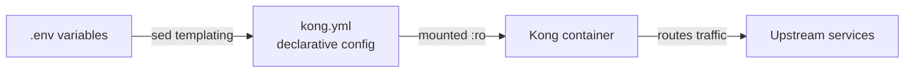

# Kong Gateway Configuration Guide

This guide explains how to manage API endpoints through the Kong declarative configuration. Kong is the sole ingress point for all client traffic in the mini-baas stack. Understanding its configuration model is necessary for adding services, modifying routes, applying plugins, and debugging routing issues.

---

## Table of Contents

- [Configuration Model](#configuration-model)
- [Current Route Table](#current-route-table)
- [Declarative Config Structure](#declarative-config-structure)
- [Adding Endpoints](#adding-endpoints)
  - [Add a path to an existing service](#add-a-path-to-an-existing-service)
  - [Add a new service with routes](#add-a-new-service-with-routes)
  - [Add plugins to a service](#add-plugins-to-a-service)
- [Key Parameters](#key-parameters)
- [Plugin Configuration](#plugin-configuration)
  - [CORS (global)](#cors-global)
  - [API key authentication](#api-key-authentication)
  - [Rate limiting](#rate-limiting)
  - [Request transformation](#request-transformation)
- [Validation and Deployment](#validation-and-deployment)
- [Admin API (debug only)](#admin-api-debug-only)
- [Upstream Service Reference](#upstream-service-reference)
- [Troubleshooting](#troubleshooting)
- [Best Practices](#best-practices)

---

## Configuration Model

Kong runs in **database-off** (declarative) mode. Its entire configuration lives in a single YAML file:

```
docker/services/kong/conf/kong.yml
```



There is no database behind Kong. Changes to routing, plugins, or consumers require editing the YAML file and restarting the container. Environment variables (API keys, secrets) are injected at startup through `sed` templating in the Kong entrypoint.

---

## Current Route Table

| Public Path | Service | Internal Target | Key Plugins |
|-------------|---------|-----------------|-------------|
| `/auth/v1` | GoTrue | `http://gotrue:9999` | key-auth, rate-limiting |
| `/rest/v1` | PostgREST | `http://postgrest:3000` | key-auth, rate-limiting |
| `/mongo/v1` | mongo-api | `http://mongo-api:3010` | key-auth, rate-limiting |
| `/realtime/v1` | Realtime | `http://realtime:4000` | key-auth, rate-limiting |
| `/storage/v1` | MinIO | `http://minio:9000` | key-auth, rate-limiting, request-size-limiting |
| `/meta/v1` | pg-meta | `http://pg-meta:8080` | key-auth |
| `/studio` | Studio | `http://studio:3000` | key-auth |

All routes also inherit the **global CORS plugin**.

---

## Declarative Config Structure

```yaml
_format_version: "3.0"
_transform: true

# Global plugins — applied to every route
plugins:
  - name: cors
    config:
      origins: ["*"]
      methods: [GET, POST, PUT, PATCH, DELETE, OPTIONS]
      headers: [Authorization, Content-Type, apikey, x-client-info]
      credentials: true

# Consumers — API key holders
consumers:
  - username: anon
    keyauth_credentials:
      - key: ${ANON_KEY}
  - username: service_role
    keyauth_credentials:
      - key: ${SERVICE_ROLE_KEY}

# Services — each maps to one upstream
services:
  - name: gotrue
    url: http://gotrue:9999
    plugins:
      - name: key-auth
        config: { key_names: [apikey] }
      - name: rate-limiting
        config: { minute: 60, policy: local }
    routes:
      - name: gotrue-route
        paths: [/auth/v1]
        strip_path: true
```

---

## Adding Endpoints

### Add a path to an existing service

To expose an additional path that routes to a service already in the config, append to its `paths` array:

```yaml
services:
  - name: gotrue
    url: http://gotrue:9999
    routes:
      - name: gotrue-route
        paths:
          - /auth/v1
          - /auth/admin    # new path
        strip_path: true
```

### Add a new service with routes

To proxy a service not yet registered in Kong, add a new service block:

```yaml
services:
  - name: custom-service
    url: http://custom-service:3000
    plugins:
      - name: key-auth
        config:
          key_names: [apikey]
    routes:
      - name: custom-route
        paths: [/api/custom]
        strip_path: true
        methods: [GET, POST, PUT, PATCH, DELETE, OPTIONS]
```

### Add plugins to a service

Plugins declared under a service apply to all of its routes:

```yaml
services:
  - name: protected-service
    url: http://internal-service:8080
    plugins:
      - name: key-auth
        config:
          key_names: [apikey]
          hide_credentials: true
      - name: rate-limiting
        config:
          minute: 100
          policy: local
    routes:
      - name: protected-route
        paths: [/protected]
```

---

## Key Parameters

### `strip_path`

Controls whether Kong removes the matched path prefix before forwarding:

| Value | Behavior | Example |
|-------|----------|---------|
| `true` | Prefix stripped | `GET /auth/v1/health` → upstream receives `GET /health` |
| `false` | Path forwarded as-is | `GET /auth/v1/health` → upstream receives `GET /auth/v1/health` |

Most services in this stack expect `strip_path: true` because they handle root-relative paths internally.

### `methods`

Restricts which HTTP methods the route accepts. Omit the field to accept all methods.

### `protocols`

Defaults to `["http", "https"]`. WebSocket proxying works through standard `http`/`https` routes combined with `Upgrade` headers.

### `hosts`

Optional host-based routing. Useful for multi-tenant deployments:

```yaml
routes:
  - name: tenant-route
    paths: [/api]
    hosts: [api.tenant-a.com]
```

---

## Plugin Configuration

### CORS (global)

The global CORS plugin is already configured and applies to all routes:

```yaml
plugins:
  - name: cors
    config:
      origins: ["*"]
      methods: [GET, POST, PUT, PATCH, DELETE, OPTIONS]
      headers: [Authorization, Content-Type, apikey, x-client-info]
      credentials: true
```

To restrict origins for a non-local environment:

```yaml
origins:
  - https://app.example.com
  - https://staging.example.com
```

### API key authentication

```yaml
plugins:
  - name: key-auth
    config:
      key_names: [apikey]
      hide_credentials: false
```

When `hide_credentials` is `true`, Kong strips the `apikey` header before forwarding to the upstream.

### Rate limiting

```yaml
plugins:
  - name: rate-limiting
    config:
      minute: 100
      hour: 5000
      policy: local
```

### Request transformation

Remove or add headers before forwarding:

```yaml
plugins:
  - name: request-transformer
    config:
      remove:
        headers: [x-forwarded-for]
      add:
        headers: ["x-custom-header:value"]
```

---

## Validation and Deployment

**Step 1 — Validate the config before restarting:**

```bash
docker run --rm -e KONG_DATABASE=off \
  -e KONG_DECLARATIVE_CONFIG=/tmp/kong.yml \
  -v "$PWD/docker/services/kong/conf/kong.yml:/tmp/kong.yml:ro" \
  kong:3.8 kong config parse /tmp/kong.yml
```

Expected output: `parse successful`

**Step 2 — Restart Kong to load changes:**

```bash
docker compose restart kong
```

**Step 3 — Test the new route:**

```bash
curl -i http://localhost:8000/your/new/path \
  -H "apikey: $ANON_KEY"
```

A syntax error in `kong.yml` will prevent Kong from starting entirely. Always validate first.

---

## Admin API (debug only)

Kong exposes a read-only admin API at `:8001` in declarative mode:

```bash
curl http://localhost:8001/services     # List all services
curl http://localhost:8001/routes       # List all routes
curl http://localhost:8001/plugins      # List active plugins
```

This is useful for confirming that the declarative config was loaded correctly.

---

## Upstream Service Reference

| Service | Port | `strip_path` Behavior | Notes |
|---------|------|----------------------|-------|
| GoTrue | 9999 | Works with `true` | Responds at `/health` for health checks |
| PostgREST | 3000 | Works with `true` | Validates JWTs via `PGRST_JWT_SECRET` |
| mongo-api | 3010 | Works with `true` | Validates JWTs via `JWT_SECRET` |
| Realtime | 4000 | Works with `true` | Requires HTTP Upgrade headers for WebSocket |
| MinIO | 9000 | Works with `true` | S3-compatible API |
| pg-meta | 8080 | Works with `true` | Used by Studio for schema inspection |
| Studio | 3000 | Check path expectations | Needs `SUPABASE_URL` pointing to Kong |
| Trino | 8080 | Not currently exposed via Kong | Available for future federation routes |

---

## Troubleshooting

### Route not responding

1. Validate config syntax: run the parse command above.
2. Check Kong logs: `docker compose logs kong | tail -30`.
3. Verify the upstream is healthy: `docker compose ps`.
4. Confirm path matching is case-sensitive and exact.

### 502 Bad Gateway

The upstream service is down or unreachable. Check:

- `docker compose ps` — is the service running?
- `docker compose logs <service>` — any startup errors?

### 404 Not Found

No route matches the request path. Verify:

- The path in `kong.yml` matches the request (case-sensitive).
- `strip_path` is set correctly for the upstream's expectations.

---

## Best Practices

1. **Always validate before deploying.** A single syntax error breaks the entire gateway.
2. **Use versioned paths** (`/api/v1/resource`). This simplifies future API migrations.
3. **Apply auth at the service level** so all routes under a service inherit it.
4. **Mount config read-only.** The volume is `:ro` to prevent accidental modification inside the container.
5. **Test `strip_path` behavior** for every new route. If uncertain, check Kong logs to see what path the upstream received.
6. **Document upstream expectations** (required headers, expected path format) alongside the route definition.
