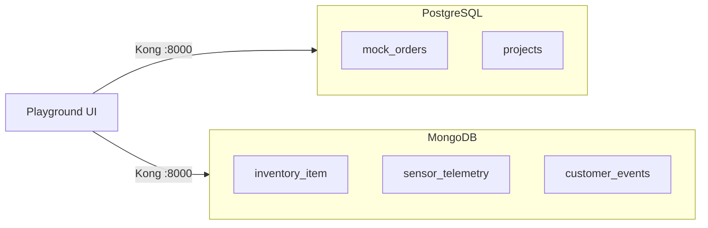
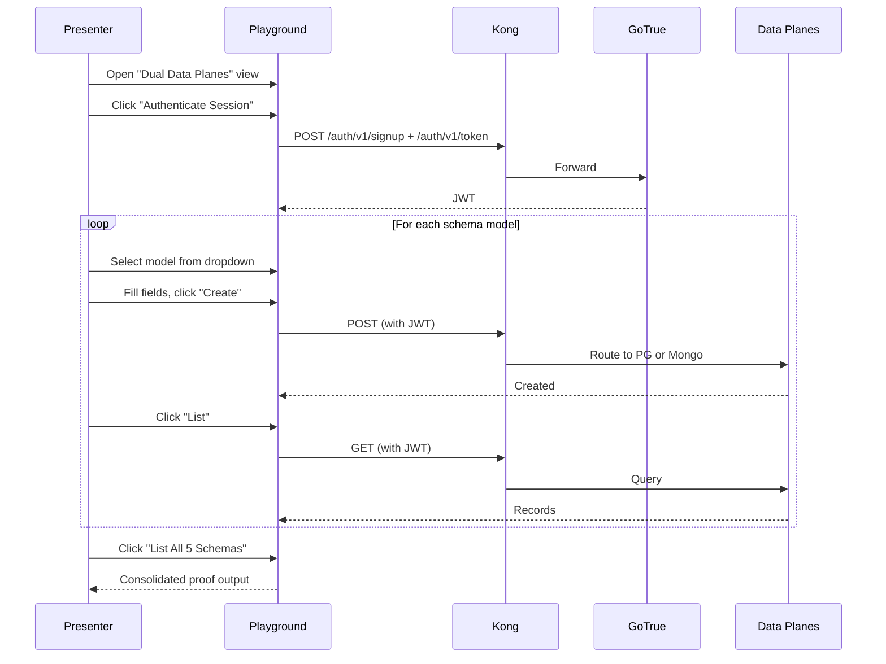

# Partner Demo Runbook

This runbook provides a structured script for demonstrating the mini-baas dual data-plane architecture. The demo proves that a single gateway, a single authentication flow, and a single UI can perform full CRUD operations across five distinct schema models spanning PostgreSQL and MongoDB.

---

## Table of Contents

- [Demo Scope](#demo-scope)
- [Prerequisites](#prerequisites)
- [Environment Setup](#environment-setup)
- [Demo Flow](#demo-flow)
- [Proof Output](#proof-output)
- [Suggested 7-Minute Script](#suggested-7-minute-script)
- [Expected Responses](#expected-responses)
- [Troubleshooting](#troubleshooting)

---

## Demo Scope

The demo exercises five schema models across both data planes:



| # | Model | Data Plane |
|---|-------|-----------|
| 1 | `mock_orders` | PostgreSQL |
| 2 | `projects` | PostgreSQL |
| 3 | `inventory_item` | MongoDB |
| 4 | `sensor_telemetry` | MongoDB |
| 5 | `customer_events` | MongoDB |

---

## Prerequisites

- Docker and Docker Compose installed
- Node.js / npm available (for playground CSS build)
- Ports available: `8000` (Kong), `3100` (Playground), `5432` (PostgreSQL), `27017` (MongoDB)

---

## Environment Setup

From the repository root:

```bash
make compose-up         # Start the BaaS stack
make playground-up      # Build and start the playground frontend
make compose-ps         # Verify all services are healthy
```

Health checks (optional):

```bash
curl -sS http://localhost:8000/auth/v1/health  -H "apikey: public-anon-key"
curl -sS http://localhost:8000/rest/v1/        -H "apikey: public-anon-key"
curl -sS http://localhost:8000/mongo/v1/health -H "apikey: public-anon-key"
```

Open the playground: **http://localhost:3100**

---

## Demo Flow



Step-by-step:

1. Open the **Dual Data Planes** view in the playground.
2. Click **Authenticate Session** to create a user and obtain a JWT.
3. Select a schema model from the dropdown.
4. Fill the generated fields and click **Create**.
5. Click **List** to confirm the record exists.
6. Repeat for at least one PostgreSQL and one MongoDB model.
7. Click **List All 5 Schemas** — this produces the consolidated proof output.
8. Optionally demonstrate **Update** and **Delete** on a selected record.

---

## Proof Output

The "List All 5 Schemas" output contains:

| Field | Description |
|-------|-------------|
| Authenticated user ID | The JWT subject used for all requests |
| Timestamp | When the proof was generated |
| Per-model entry | Data plane, resource name, HTTP status, record count, sample IDs |

This is the primary deliverable for the demo — proof that five distinct models are independently queryable through one gateway and one auth context.

---

## Suggested 7-Minute Script

| Minute | Action |
|--------|--------|
| 0–1 | Explain the architecture: one gateway, one auth flow, two data planes, one UI |
| 1–2 | Authenticate the session |
| 2–3 | Create a PostgreSQL record (`projects`) |
| 3–4 | Create a MongoDB record (`inventory_item`) |
| 4–5 | List each model individually |
| 5–6 | Run **List All 5 Schemas** and show per-model counts and IDs |
| 6–7 | Demonstrate Update and Delete on one model to prove full CRUD |

**Closing statement:** "This demo shows runtime CRUD generation across five distinct models spanning PostgreSQL and MongoDB, with shared gateway security and shared auth context, while preserving model-specific storage behavior."

---

## Expected Responses

| Operation | PostgreSQL | MongoDB |
|-----------|-----------|---------|
| Create | `201` or `200` (depends on table and PostgREST behavior) | `201` with `{ success: true, data: { id, ... } }` |
| List | `200` with array body | `200` with `{ success: true, data: [...], meta: {...} }` |
| Update | `200` with updated row | `200` with `{ success: true, data: { ... } }` |
| Delete | `200` or `204` | `200` with `{ success: true, data: { deleted: true } }` |

---

## Troubleshooting

### Auth session fails

```bash
curl -i http://localhost:8000/auth/v1/health -H "apikey: public-anon-key"
```

If unhealthy, check GoTrue logs: `make compose-logs SERVICE=gotrue`.

### PostgreSQL CRUD fails

```bash
# Verify PostgREST is responding
curl -i http://localhost:8000/rest/v1/ -H "apikey: public-anon-key"

# Verify tables exist
docker exec mini-baas-postgres psql -U postgres -d postgres -c "\dt public.*"
```

### MongoDB CRUD fails

```bash
# Verify mongo-api health
curl -i http://localhost:8000/mongo/v1/health -H "apikey: public-anon-key"

# Check service logs
make compose-logs SERVICE=mongo-api
```

### Playground not loading

Rebuild and restart:

```bash
make playground-down
make playground-up
```
