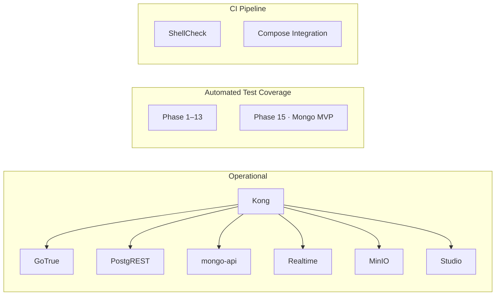

# Project Status

This document captures the current state of the mini-baas infrastructure and identifies the priorities for the next phase of work.

---

## Current State

The platform is running as a Docker Compose-first stack with the following components operational:

The previous gateway-integration blocker is resolved. Route-level API key enforcement, CORS policy, and rate limiting are active and validated through CI.

---

## What Is Working

| Area | Detail |
|------|--------|
| Declarative routing | Kong routes traffic to auth, rest, mongo, realtime, storage, meta, and studio endpoints |
| Gateway plugins | `key-auth`, `rate-limiting`, `request-size-limiting`, and global `cors` are active on all applicable routes |
| Test automation | Phases 1 through 13 (plus phase 15 for MongoDB) run through `make tests` |
| CI pipeline | GitHub Actions executes shell checks and full Compose integration tests on push and pull request |
| Dual data plane | PostgreSQL (via PostgREST with RLS) and MongoDB (via mongo-api with `owner_id` filtering) are both fully operational |

---

## Current Gaps

The remaining work is alignment and hardening, not initial integration:

| Gap | Detail |
|-----|--------|
| Documentation drift | Some files reference outdated commands, paths, or status wording |
| Permissive late-phase assertions | Phases 11–13 contain soft-pass checks that should become strict validations |
| Gateway policy hardening | CORS, key management, and rate limits are configured for local development only |
| Service contract depth | Contract documents under `docker/contracts/` contain placeholders that need operational detail |

---

## Priorities

1. **Keep documentation aligned** with the current stack behavior and Make targets.
2. **Tighten test assertions** in phases 11–13 so soft-pass checks become explicit pass/fail.
3. **Define environment-specific security profiles** for CORS origins and API key management.
4. **Complete service contract documentation** with request/response examples and failure modes.

---

## Summary

The project is in a functional and testable state for local BaaS development. The next phase is reliability and documentation hardening.
