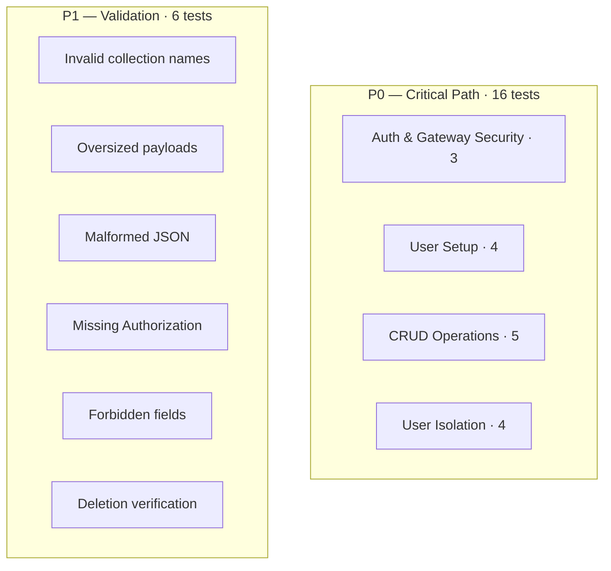

# Execution Plan — MongoDB Integration Testing

**Target date:** April 1, 2026
**Prerequisite:** All infrastructure is already in place. This plan covers execution and verification only.

---

## Table of Contents

- [Pre-Conditions](#pre-conditions)
- [Execution Steps](#execution-steps)
  - [Step 1 — Generate Environment Variables](#step-1--generate-environment-variables)
  - [Step 2 — Start the Stack](#step-2--start-the-stack)
  - [Step 3 — Run the Test Suite](#step-3--run-the-test-suite)
  - [Step 4 — Manual Verification (optional)](#step-4--manual-verification-optional)
- [Test Coverage](#test-coverage)
- [Troubleshooting](#troubleshooting)
- [Timeline](#timeline)

---

## Pre-Conditions

| Requirement | Status |
|-------------|--------|
| mongo-api service implemented | Ready |
| Kong route configured at `/mongo/v1` | Ready |
| Docker Compose includes `mongo-api` service | Ready |
| Environment variable generation script exists | Ready |
| Test script created (`phase15-mongo-mvp-test.sh`) | Ready |

---

## Execution Steps

### Step 1 — Generate Environment Variables

```bash
cd /home/dlesieur/mini-baas-infra

bash scripts/generate-env.sh .env

# Verify the critical variable exists
grep JWT_SECRET .env
```

### Step 2 — Start the Stack

```bash
# Clean slate (removes volumes if schema changed)
docker compose down -v

# Start all services
docker compose up -d

# Wait for health checks
sleep 10

# Verify
docker compose ps
```

Expected: all core services show `Up (healthy)`.

### Step 3 — Run the Test Suite

```bash
bash scripts/phase15-mongo-mvp-test.sh
```

Expected output:

```
MongoDB MVP Integration Test Suite
===================================
Gateway: http://localhost:8000
Collection: tasks

=== P0: Auth and Gateway Security ===
...
=== Test Summary ===
Passed: 22
Failed: 0
Pass Rate: 100% (22/22)
```

### Step 4 — Manual Verification (optional)

Individual endpoint tests for hands-on inspection:

```bash
# Extract the API key
ANON_KEY=$(grep "^KONG_PUBLIC_API_KEY=" .env | cut -d= -f2)

# Health check
curl -s http://localhost:8000/mongo/v1/health \
  -H "apikey: $ANON_KEY" | jq .

# Signup
curl -s -X POST http://localhost:8000/auth/v1/signup \
  -H "apikey: $ANON_KEY" \
  -H "Content-Type: application/json" \
  -d '{"email":"test@example.com","password":"Test@1234567890"}' | jq .

# Login and capture JWT
JWT=$(curl -s -X POST 'http://localhost:8000/auth/v1/token?grant_type=password' \
  -H "apikey: $ANON_KEY" \
  -H "Content-Type: application/json" \
  -d '{"email":"test@example.com","password":"Test@1234567890"}' \
  | jq -r '.data.session.access_token')

# Create a document
curl -s -X POST http://localhost:8000/mongo/v1/collections/tasks/documents \
  -H "apikey: $ANON_KEY" \
  -H "Authorization: Bearer $JWT" \
  -H "Content-Type: application/json" \
  -d '{"document":{"title":"My First Task","status":"todo"}}' | jq .

# List documents
curl -s http://localhost:8000/mongo/v1/collections/tasks/documents \
  -H "apikey: $ANON_KEY" \
  -H "Authorization: Bearer $JWT" | jq .
```

---

## Test Coverage

The test suite validates 22 cases across two priority tiers:



### P0 — Critical for MVP

| Category | Tests | What Is Verified |
|----------|-------|-----------------|
| Auth & gateway security | 3 | Missing apikey rejected, invalid apikey rejected, valid apikey accepted |
| User setup | 4 | Signup user A, login user A, signup user B, login user B |
| CRUD operations | 5 | Create, list, get single, update, delete |
| User isolation | 4 | User B cannot get/patch/delete user A's docs, user B's list excludes user A's docs |

### P1 — Validation and Error Handling

| Category | Tests | What Is Verified |
|----------|-------|-----------------|
| Input validation | 6 | Path traversal in collection names, 256 KB payload limit, malformed JSON, missing auth header, `owner_id` override attempt, deletion confirmation |

---

## Troubleshooting

### Services fail to start

```bash
docker compose logs mongo-api
docker compose logs kong
```

### Test fails at authentication

```bash
# Check GoTrue health
docker compose logs gotrue | tail -20

# Verify JWT_SECRET is set
env | grep JWT_SECRET
```

### MongoDB endpoints not responding

```bash
docker compose ps mongo-api
docker compose logs mongo-api
```

### User isolation tests fail

```bash
# Inspect documents directly
docker compose exec mongo mongosh --eval "
  use mini_baas;
  db.tasks.find().pretty();
"
```

---

## Timeline

| Step | Estimated Time |
|------|---------------|
| Generate `.env` | 2 minutes |
| Start stack | 3 minutes |
| Run test suite | 5 minutes |
| **Total** | **~10 minutes** |

After all 22 tests pass, proceed to integrate the test script into the Makefile runner and begin work on the PostgreSQL MVP test phase.
