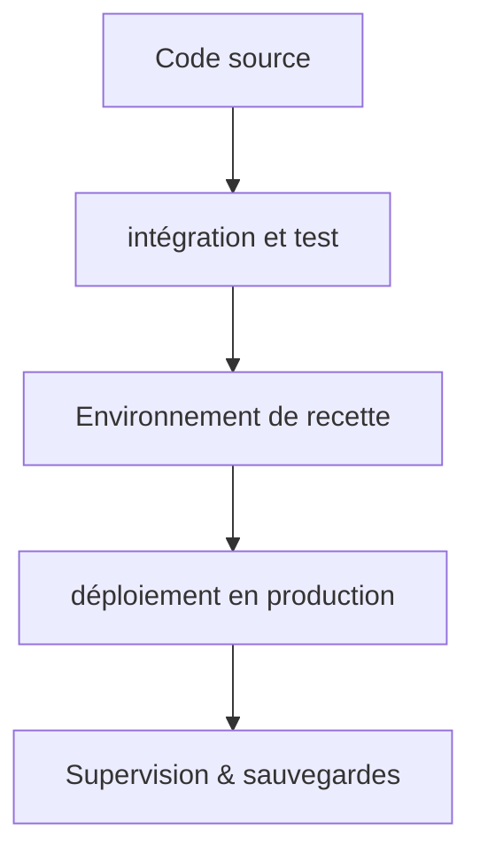

# DOSSIER DE PROJET

## Développeur web et web mobile

## LESIEUR DYLAN

## TABLE DES MATIÈRES

1. [DOSSIER DE PROJET](#dossier-de-projet)
2. [TABLE DES MATIÈRES](#table-des-matières)
3. [CHAPITRE 1. Synthpere des compétences mobilisées]
4. [CHAPITRE 2. Présentation du projet]
5. [CHAPITRE 3. Les réalisations personnelles, front-end (React / SCSS)]
6. [CHAPITRE 4. Les réalisations personnelles, back-end (Node.js / Express / MongoDB / POSTGRESQL)]
7. [CHAPITRE 5. Eléments de sécurité de l'application]
8. [CHAPITRE 6. Jeu d'essai]
9. [CHAPITRE 8. Conclusion]
10. [Annexes]

## CHAPITRE 1. Synthèse des compétences mobilisées

La réalisation du projet **prismatica**, une applicaiton de gestion de base de données pour les entreprises, a mobilisé un large éventail de compétences techniques et méthodologiques. Voici une synthèse des compétences clés utilisées tout au long du projet. Mon intervention a porté sur la conception d'une solution robute, sécurisée et optimisée pour l'usage desktop.

Mon travail s'est équilibré entre la production d'interfaces utilistateur (front-end) et la mise en place de l'infrastructure de données et de la logique métier (back-end).

> Actvité type n°1 : Développer la partie front-end d'une application web ou web mobile sécurisée.

**Conception des interfaces utilisateur (MAQUETTER)** j'ai initié le projet par la création des maquettes. J'ai utilisé des outils de design pour élaborer des maquettes visuelles de l'application, en tenant compte de l'expérience utilisateur (UX) et de l'interface utilisateur (UI). Ces maquettes ont servi de guide pour le développement front-end, assurant une cohérence visuelle et une navigation intuitive. Dans le contexte de ce projet, utilisé la technique "mobile first" n'était pas la bonne stratégie pour le manque de temps et la nature desktop de l'application. J'ai donc opté pour une approche "desktop first", en me concentrant sur la création d'une interface optimisée pour les utilisateurs de bureau, tout en veillant à ce qu'elle soit responsive pour les appareils mobiles. Le choix de conception est plutot logique.. due aux contraintes liés à la complexité de l'application, utiliser la technique mobile first aurait pu compliquer et engendrer une dette technique importante. Elle n'est toutefois pas mise de côté car dans le futur, une fois totalement stable et fonctionnelle. nous envisageronns une refonte de l'interface pour adopter une approche mobile first, afin d'améliorer l'expérience utilisateur sur les appareils mobiles. En plus l'autre avantae indéniable que donne cette approche est la possibilité de débugger rapidement et incrémenter la valeur ajouter de l'application en se concentrant sur les fonctionnalités essentielles pour les utilisateurs de bureau, qui sont la cible principale de l'application.

\*\*Intégration des interfaces statiques (Réaliser) J'ai structuré l'application en utilisant le HTML sémantique pour le contenu et le SCSS pour l'organisation des styles. J'ai mis en place des grilles flexibles et des requêtes média pour assurer l'adaptation de l'affichage sur tous les supports, garantissant ainsi l'aspect responsive de l'application.

**Développement de l'interactivité (Développer la partie dynamique)** J'ai utilisé la bibliothèque **React** pour donner vie aux interfaces. Mon rôle a consisté à gérer les appels asyncrhones vers l'API, les mises à jour conditionnelles de l'interface (suite aux changement de statut d'intervention) et l'implémentation de formulaires réactifs pour une expérience utilisateur rapide.

> Activité type n°2 : Développer la partie back-end d'une application web ou web mobile sécurisée.

BaaS (Backend as a Service) est une solution qui fournit une infrastructure de back-end préconfigurée, permettant aux développeurs de se concentrer sur la logique métier plutôt que sur la gestion de l'infrastructure. En adoptant une approche orientée `data mesh`, j'ai structuré le back-end de manière à favoriser la décentralisation et la distribution des données, facilitant ainsi la scalabilité et la résilience de l'application. orientée Docker Compose, conçue comme une **usine à backend génériques** capable de fournir authentification, données relationnelles, données documentaires, requêtage multi-tenant, temps réel, stockage objet, email transactionnel, politique de sécurité unifiées sans développement d'API métier spécifique pour chaque nouveau projet.

| Membre   | Rôle principal                                     | Responsabilités observées / déduites                                                                                                                                    |
| -------- | -------------------------------------------------- | ----------------------------------------------------------------------------------------------------------------------------------------------------------------------- |
| dlesieur | Product Owner / Tech Lead / DevOps / Back-End Lead | Conception de l'architecture, intégration Docker, orchestration des services, sécurité, écriture des services NestJS, outillage d'exploitation, documentation technique |

**Modélisation de la base de données** J'ai conçu le schéma de la base de données relationnelle **PostgreSQL** pour stocker les données de l'application, en veillant à la normalisation et à l'optimisation des requêtes. J'ai également utilisé **MongoDB** pour certaines fonctionnalités nécessitant une flexibilité accrue dans la gestion des données. La modélisation a permis de structurer les données de manière efficace, facilitant ainsi les opérations de lecture et d'écriture en définissant des relations claires entre les différentes entités de l'application et les contraintes d'intégrité.

**Élaboration des composants d'accès aux données**, j'ai développé des composants d'accès aux données pour interagir avec les bases de données. J'ai utilisé des API gateway telles que `kong` pour gérer les requêtes et assurer une communication fluide entre le front-end et le back-end. J'ai également mis en place des mécanismes de cache pour améliorer les performances de l'application. Pour que l'application bass soit robuste, j'ai utilisé un moteur SQL distribué `trino` pour gérer les requêtes complexes et les grandes quantités de données, assurant ainsi une performance optimale même avec des volumes de données importants.

## CHAPITRE 2. Présentation du projet

### Présentation de l'entreprise

**Prismatica** est une entreprise spécialisée dans le dashboarding et la gestion de données pour les entreprises. Elle propose des solutions innovantes pour aider les entreprises à visualiser et à analyser leurs données de manière efficace, facilitant ainsi la prise de décision stratégique. L'entreprise se distingue par son approche centrée sur l'utilisateur, offrant des interfaces intuitives et personnalisables pour répondre aux besoins spécifiques de chaque client. Prismatica s'engage à fournir des outils puissants et flexibles pour permettre aux entreprises de tirer le meilleur parti de leurs données, en mettant l'accent sur la sécurité, la performance et la facilité d'utilisation en centralisant les données de l'entreprise dans une plateforme unique et accessible qui permet de visualiser et de modifier les données en temps réel et interactivement.

Le rôle de l'équipe est de moderniser les applications de gestion de données déjà existantes en adoptant une approche orientée `data mesh` et en utilisant des technologies modernes telles que Docker Compose pour créer une usine à backend génériques. L'objectif est de fournir une solution robuste, sécurisée et évolutive qui répond aux besoins spécifiques des entreprises tout en facilitant la maintenance et l'évolution future de l'application.

### Cahier des charges du projet

#### contexte et objectifs

Le projet **prismatica** vise à développer une application de gestion de base de données pour les entreprises, offrant une interface utilisateur intuitive et des fonctionnalités avancées pour la visualisation et la manipulation des données. Le projet a été initié poiur pallier les lourdeurs d'un processus des interventions techniques basé sur des outils anciens et hétérogènes. à la manière de clickup ou notion l'application se veut versatile en laissant les utilisateurs créer et composer leurs dashbboard d'application directment dans leurs pages web, localement ou dans le cloud. Cette fragmentation engendrait une latence importante entre la réalisation d'une intervention et sa remontée dans le système de facturation.

L'application a été conçue pour centraliser et numémirer l'ensemble des opérations logistiques, remplaçant les processus basés sur des outils anciens.

Cette refonte visait principalement à fluidifier l'activité. il fallait rendre la consultation et la mise à jour des missios quotidiennes instantannées pour le technicien, opérant directement depuis le terrain.

Un autre objectif majeur était de sécuriser les données, en assurant la traçabilité complète du cycle de vie de chaque intervention et en protégeant les informations sensibles contre les accès non autorisés.

Enfin un autre objectif était d'améliorer la performance de l'application, en optimisant les requêtes et en utilisant des technologies modernes pour garantir une expérience utilisateur rapide et réactive, même avec de grandes quantités de données.

#### objectifs du projet et choix architecturaux

Le projet **prismatica** poursuivait différents objectifs:

- la centralisation des données de l'entreprise dont prismatica pourrait faciliter la visualisation et la manipulation en temps réel et de manière interactive.
- la sécurisation des données, en assurant la traçabilité complète du cycle de vie

Pour le backend, plusieurs problèmes s'étaient posés:

- le back ne devait jamais savoir le type de données qu'il manipule, il devait être générique et orienté data mesh pour permettre une scalabilité et une flexibilité maximale.
- le back devait être orienté docker compose pour permettre une orchestration facile des services et une gestion efficace des dépendances.

au final il est devenu logique pour nous même de créer un baas (backend as a service) orienté docker compose, conçue comme une usine à backend génériques capable de fournir authentification, données relationnelles, données documentaires, requêtage multi-tenant, temps réel, stockage objet, email transactionnel, politique de sécurité unifiées sans développement d'API métier spécifique pour chaque nouveau projet, ABAC, RBAC, PBAC, etc.

Chaque choix technologique a été validé non seulement pour sa capacité à délivrer les fonctionnalités attendues, mais également pour sa résilience et sa sécurité face aux contraintes du projet.

#### Architectures logicielles et choix tecnhniques

#### outillage de développement et de déploiement

#### stratégie de sécurisation

### Public cible et profils utilisateurs

#### définition du public cible

#### détails des profils utilisateurs

### Fonctionnalités attendues

#### clients

#### administrateurs

#### users non authentifiés

#### MVP

#### perspective d'évolution

### Contraintes et risques

### les livrables

### Environnement humain et technique

#### Environnements humain et méthodologie

j'ai travaillé au sein d'une équipe de développement fonctionnant sous la méthodologie **Agile (Scrumban)**. Ce cadre a permis des cycles de développement itératifs et une collaboration étroite entre les membres de l'équipe, favorisant ainsi une adaptation rapide aux changements et une livraison continue de valeur. Nous avons utilisé des outils de gestion de projet tels que **Jira** pour suivre les tâches, les sprints et les progrès du projet, assurant une transparence totale et une communication efficace au sein de l'équipe.

les différents rôles au sein de l'équipe comprenaient un Product Owner, un Tech Lead, des développeurs front-end et back-end, ainsi que des spécialistes en sécurité. Chaque membre de l'équipe avait des responsabilités spécifiques, contribuant à la réussite globale du projet.

| Membre   | Rôle                                                    | spécialité             | Responsabilités observées / déduites                                                                                                                                    |
| :------- | ------------------------------------------------------- | ---------------------- | ----------------------------------------------------------------------------------------------------------------------------------------------------------------------- |
| dlesieur | Product Owner / Tech Lead / Product manager / developer | project chef           | Conception de l'architecture, intégration Docker, orchestration des services, sécurité, écriture des services NestJS, outillage d'exploitation, documentation technique |
| daniel   | Product Owner / Developeur                              | assistant project chef | Conception et développement des interfaces utilisateur, intégration avec le back-end, optimisation de l'expérience utilisateur                                          |
| sergio   | Tech Lead / Développeur                                 | frontend               | Conception et développement de l'API, gestion de la base de données, implémentation de la logique métier, sécurité du back-end                                          |
| roxanne  | Tech Lead                                               | security               | Analyse des risques de sécurité, mise en place de mesures de protection, audits de sécurité, conformité RGPD                                                            |
| vadim    | Product Manager / Developer                             | scrum manager          | Analyse des risques de sécurité, mise en place de mesures de protection, audits de sécurité, conformité RGPD                                                            |

J'étais donc au centre du processus, responsable de la chaîne complète de développement, de la donnée(BDD) à l'interface (front-end). L'organization de mon équipe tourné autour des principes de scrum, avec des réunions quotidiennes pour synchroniser les progrès, des revues de sprint pour évaluer les livrables et des rétrospectives pour identifier les axes d'amélioration. Cette approche a permis une collaboration efficace et une adaptation rapide aux changements de priorités ou de besoins du projet.

##### Rituels

Scrumban combine les éléments de Scrum et de Kanban pour offrir une flexibilité maximale dans la gestion des projets. Nous avons d'une part
scrum avec lequel des rituels mis en place pour assurer une collaboration efficace et une livraison continue de valeur:

- **Daily Stand-up**: une réunion quotidienne de 15 minutes pour synchroniser les progrès, identifier les obstacles et planifier les tâches pour la journée.
- **Sprint Planning**: une réunion au début de chaque sprint pour planifier les tâches à
- **DoD** (Definition of Done): une liste de critères que chaque tâche doit remplir pour être considérée comme terminée, assurant ainsi la qualité et la cohérence des livrables.
- **Sprint Review**: une réunion à la fin de chaque sprint pour présenter les livrables aux parties prenantes, recueillir des feedbacks et ajuster les priorités pour les prochains sprints.
- **Sprint Retrospective**: une réunion pour réfléchir sur le sprint écoulé, identifier ce qui a bien fonctionné, ce qui peut être amélioré et définir des actions concrètes pour améliorer les processus de travail.

mais aussi kanban avec lequel nous avons mis en place un tableau de tâches visuel pour suivre l'avancement du projet, avec des colonnes représentant les différentes étapes du processus de développement (To Do, In Progress, Done). Cela a permis une gestion flexible des tâches et une adaptation rapide aux changements de priorités.

> Contraintes:
> comme le projet avait une portée relativement large, il était essentiel de maintenir une communication claire et efficace au sein de l'équipe pour éviter les > malentendus et assurer une coordination fluide. De plus, la gestion du temps était un défi constant, nécessitant une planification rigoureuse et une capacité à s'adapter rapidement aux changements de priorités ou de besoins du projet. À cet effet, nous avons mis en place une fois par semaine une réunion pour travailler l'écoute active et autre modalité de communication pour améliorer la collaboration au sein de l'équipe.
> :warning: utiliser kanban pour l'intégralité du projet était une option trop lourde due à la largeur et la complexité du projet, et parce que nous étions habitué de faire des projets en solitaires beaucoup plus petits, nous avons opté pour utiliser le kanban seulement quand le container à créer demandé un très haut niveau de rigueur et de suivi, comme c'était le cas pour la partie développement du front-end avec `osionos` un container qui créer littéralement l'interface applicative de la solution. [pour en savoir plus](#ref-osionos)

##### Post de développement

- système d'exploitation: j'ai opéré sur un environnement Linux (Ubuntu) pour le développement, offrant une compatibilité optimale avec les outils et technologies utilisés dans le projet.
- IDE: Mon environnement de développement principal était **Visual Studio Code**, complété par des extensions pour l'investigation de code, la gestion de Git et le développement en React et Node.js.
- Environnement: J'ai utilisé l'environnement Node.js LTS (version stable recommandée) et l'outil npm pour gérer l'intégralité des dépendances nécessaires aux parties `front-end` et `back-end`

##### pile applicative (conforme aux choix architecturaux)

- Front-end: Développé avec la librairie `React`. La stylisation a été assurée par `SCSS` (Sass) pour une meilleur modularité des feuillees de style et pour faciliter le _responsive design_
- Back-end: Construit avec `Node.js` et le framework `vite` pour une configuration rapide et une expérience de développement optimisée. J'ai utilisé `Express` pour la gestion des routes et des middlewares, et `MongoDB` et `PostgreSQL` pour la gestion des données, en fonction des besoins spécifiques de chaque fonctionnalité.
- base de données: j'ai utilisé `MongoDB` pour stocker les utilisateurs, les clients et les interventions. Les interactions se font via l'ORM `mongoose` qui garantit une gestion efficace des données et une intégration fluide avec le back-end.

##### gestion du code et contrôle de qualité

- J'ai utilisé l'outil Git avec un dépôt hébergé sur GitHub, ce qui a permis d'assurer un suivi précis de toutes les modifications apportées au projet.
- Nous avons adopté un workflow standard (gitflow) pour la production, incluant une branch principale `main` pour le code stable en production, incluant une branche de développement (develop) pour l'intégration de nouvelles fonctionnalités (feat/, bugfix/, hotfix/, migrate/, etc.) pour le développement et des branches de release pour la préparation des déploiements en production.
- J'ai systématiquement veillé à la rédaction des commits clairs et descriptifs, en utilisant les `hook` de pré-commit pour assurer la qualité du code avant chaque commit, notamment en exécutant des tests unitaires et en vérifiant le respect des normes de codage. Cela m'a assuré d'accroitre la lisibilité de l'historique des modifications et de faciliter la collaboration avec les autres membres de l'équipe. (cela fonctionne avec un regexp)
- dans tous les containers nous sommes stricts. Nous avons mis en place des règles de linting et de formatage pour garantir la cohérence du code, ainsi que des tests unitaires pour assurer la fiabilité et la maintenabilité du code à long terme. Nous avons également utilisé des outils d'intégration continue pour automatiser les tests et les vérifications de qualité à chaque commit, assurant ainsi une livraison continue de code de haute qualité. Des outils comme `ESLint` pour le linting et `Prettier` pour le formatage ont été intégrés dans notre workflow de développement, garantissant que le code respecte les normes de style et de qualité définies par l'équipe. mais aussi des outils comme `sonarcloud` pour l'analyse de la qualité du code et la détection de vulnérabilités potentielles, assurant ainsi une sécurité renforcée et une maintenabilité à long terme du projet.
- les fonctionnalités cirtique (connexion sécurisée, mise à jour du statut d'intervention validation du rapport) ont été vérifiées par des scénarios de test manuels détaillés, afin de garantir la stabilité fonctionnelle de l'application avant son déploiement en recette.

##### Environnements

Pour garantir la qualité et la progresssion du développement, l'application a été développée et testée dans différents environnements:

- \*_Environnement de développement_: utilisé pour le développement quotidien, avec des outils de débogage et de test intégrés pour faciliter le processus de développement.
- **Environnement de test**:
  - Version intermédiaire déployée sur un serveur de test dédié, utilisant des données anonymisées.
  - Cet environnement a servi à la validation des fonctionnalités avec le Lead Technique et le Client avant tout déploiement en production.
  - C'est le lieu où la revue de Sprint a été effectuée

##### Organisation du travail et rituels de projets

Pour garantir la sécurité des accès et la confidentialité des informations critiques dans chaque environnement, j'ai appliqué la stratégie suivante:

- **Gestion des secrets**: J'ai utilisé des outils de gestion des secrets tels que `Vault` pour stocker et gérer les informations sensibles, assurant ainsi une protection robuste contre les accès non autorisés.
- **Contrôle d'accès**: J'ai mis en place des politiques de contrôle d'accès strictes, en utilisant des rôles et des permissions pour limiter l'accès aux données sensibles uniquement aux utilisateurs autorisés, garantissant ainsi la confidentialité et la sécurité des informations critiques.
- Chaque environnement (développement local, recette, production) possède sa propre version du fichier, adaptée à ses besoins de configuration spécifiques.
- le back-end Node.js accède à ses configurations uniquement via les variables d'environnement, assurant la séparation du code et des secrets.

##### Configuration et gestion des secreets

Protection maximal via `bcrypt` pour le hachage des mots de passe, `JWT` pour la gestion des sessions et des tokens d'authentification, et `Vault` pour la gestion centralisée des secrets, assurant ainsi une sécurité renforcée pour les données sensibles de l'application.

Mise en place d'une traçabilité des actions sensibles (connexions, modifications de statut) pour les besoins d'audit

Conformité aux exigences RGAA (sémantique, constrastes, navigation clavier) pour une utilisation incusive sur les terminaux mobiles.

Optimisation du temps de réponse par la pagination de l'API et l'ajout d'index SQL sur les tables fréquemment consultées, assurant ainsi une expérience utilisateur rapide et fluide même avec de grandes quantités de données.

Validation systématique par des scénarios de recette manuels sur les fonctionnalités clés (front et back-end) pour garantir la stabilité fonctionnelle du système.

##### Outillage et données de test

- Jeu de données: Établissement d'un jeu de d'essai complet et cohérent pour tester les différentes fonctionnalités de l'application, en utilisant des données anonymisées pour garantir la confidentialité et la sécurité des informations sensibles.
- Sécurité et initialisation de l'environnement de test: script SQL versionnés pour l'installation rapide et sécurisée de l'environnement de test.
- Transferabilité: Capacité d'extension des données (formats CSV/JSON) pour faciliter les audits et les migrations entre environnements.

### Objectifs de qualité

## CHAPITRE 3. Les réalisations personnelles, front-end (React / SCSS)

## Maquette de l'application et schémas

### Conception "desktop first with mobile companion" et wireframes

### Charte graphique

### typographie

### schéa d'enchainement des maquettes

### Captures d'écran des interfaces utilisateur

### Extraits de code, interfaces utilisateur statiques (React / SCSS)

#### Organisation minimal du projet front

#### Extrait de code, page de connexion (statique et accessible)

### Extrait de code, partie dynamique(React/typecript)

#### Authentification: le formulaire de connexion dynamique

#### récupération des données: la liste des interventions

#### action métier critique: mise à jour du statut d'intervention

## CHAPITRE 4. Les réalisations personnelles, back-end (Node.js / Express / MongoDB / POSTGRESQL)

### Architecture de l'API et modèle de données

#### a. Architecture de l'API et modèle de données

#### b. Schéma conceptuel de données (ERD)

### Extraits de code, structure et sécurité de l'API

#### Choix techniques (contexte et logique)

#### Extrait: controle d'ownership règle d'habilitation critique

#### Extrait 2: mise à jour du statut et validation métier

### Extrait de codes de composants d'accès aux données (DAO)

#### a. Choix techniques (contexte et logique)

#### b. Extrait: Récupération des missions d'un technicien

#### c.Extrait: mise à jour du statut de mission

#### d. Prépration du déploiement

## CHAPITRE 5. Eléments de sécurité de l'application

### Authentification et gestion des rôles

### Validation des entrées et protection contre les injections

### Protections front-end et API

### Protection contre XSS et CSRF

### Conformité RGPD

## CHAPITRE 6. Jeu d'essai

## CHAPITRE 7. Veille technologique et sécurité

### Source de veille utilisées

### vulnérabilités identifiées dans l'écosystème technologique

### failles potentielles et correctifs appliqués

### conclusion

## CHAPITRE 8. Conclusion

## Annexes
