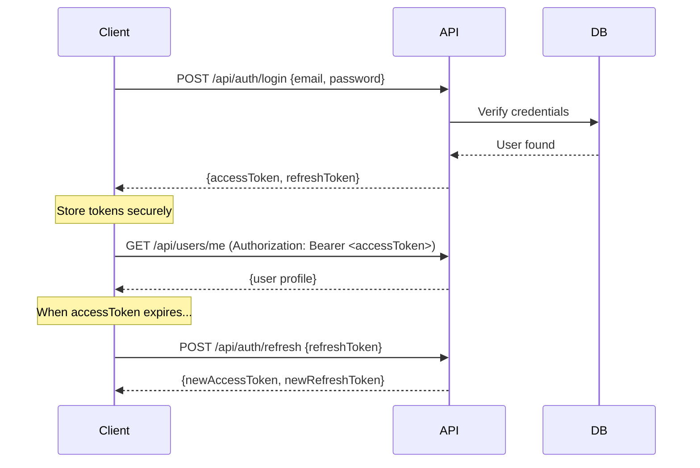

# 🔌 API Documentation

This document describes the REST API architecture and endpoint conventions for ft_transcendence.

> For auto-generated interactive docs, run the backend and visit: **http://localhost:3000/api/docs** (Swagger UI)

---

## Table of Contents

- [API Conventions](#api-conventions)
- [Authentication](#authentication)
- [Error Format](#error-format)
- [Endpoint Overview](#endpoint-overview)
- [Rate Limiting](#rate-limiting)

---

## API Conventions

### Base URL

```
http://localhost:3000/api
```

### HTTP Methods

| Method | Usage |
|--------|-------|
| `GET` | Retrieve resource(s) |
| `POST` | Create a resource |
| `PATCH` | Partially update a resource |
| `PUT` | Fully replace a resource |
| `DELETE` | Remove a resource |

### Response Format

All responses follow this structure:

```json
{
  "statusCode": 200,
  "message": "Success",
  "data": { ... }
}
```

### Pagination

List endpoints support pagination:

```
GET /api/users?page=1&limit=20&sortBy=createdAt&order=desc
```

Response includes metadata:

```json
{
  "data": [...],
  "meta": {
    "total": 150,
    "page": 1,
    "limit": 20,
    "totalPages": 8
  }
}
```

---

## Authentication

### JWT Flow



### Headers

```
Authorization: Bearer <accessToken>
Content-Type: application/json
```

---

## Error Format

All errors follow a consistent structure:

```json
{
  "statusCode": 401,
  "message": "Invalid credentials",
  "error": "Unauthorized",
  "timestamp": "2026-02-18T10:30:00.000Z",
  "path": "/api/auth/login"
}
```

### Common Status Codes

| Code | Meaning |
|------|---------|
| `200` | Success |
| `201` | Created |
| `400` | Bad Request (validation error) |
| `401` | Unauthorized (missing/invalid token) |
| `403` | Forbidden (insufficient role) |
| `404` | Not Found |
| `409` | Conflict (duplicate resource) |
| `429` | Too Many Requests (rate limited) |
| `500` | Internal Server Error |

---

## Endpoint Overview

> This is a planned overview. Endpoints will be implemented progressively.

### Auth Module

| Method | Endpoint | Description | Auth |
|--------|----------|-------------|------|
| `POST` | `/api/auth/register` | Create account | ❌ |
| `POST` | `/api/auth/login` | Login (returns JWT) | ❌ |
| `POST` | `/api/auth/refresh` | Refresh access token | 🔄 Refresh |
| `POST` | `/api/auth/logout` | Invalidate tokens | ✅ |
| `GET` | `/api/auth/oauth/callback` | OAuth callback | ❌ |

### Users Module

| Method | Endpoint | Description | Auth |
|--------|----------|-------------|------|
| `GET` | `/api/users/me` | Current user profile | ✅ |
| `PATCH` | `/api/users/me` | Update profile | ✅ |
| `GET` | `/api/users/:id` | Get user by ID | ✅ |
| `GET` | `/api/users` | List users (paginated) | ✅ Admin |

### Additional Modules

Endpoints for game, chat, matchmaking, and other features will be documented as they are implemented. Each module follows the same RESTful conventions.

---

## Rate Limiting

| Tier | Scope | Limit | Window |
|------|-------|-------|--------|
| Global | All endpoints | 100 req | 1 minute |
| Auth | `/api/auth/*` | 10 req | 1 minute |
| Heavy | File uploads, search | 20 req | 1 minute |

When rate limited, the API returns:

```json
{
  "statusCode": 429,
  "message": "Too many requests. Try again in 45 seconds.",
  "retryAfter": 45
}
```

---

*This document is updated as new endpoints are added. For the latest, check Swagger UI at `/api/docs`.*
