# Definitive Frontend Architecture — Prismatica
## FSD + Atomic Design · React 19 · TypeScript Strict 5.7 · SCSS · Zustand
> **Project:** Prismatica — Polymorphic Data Platform
> **Academic context:** ft_transcendence · Univers42, 2026
> **Team:** dlesieur · danfern3 · serjimen · rstancu · vjan-nie
> **Status:** Reference document — design phase

---

## Table of Contents

0. [FSD and Atomic Design — definitions](#0-fsd-and-atomic-design--definitions)
1. [Why this architecture](#1-why-this-architecture)
2. [The FSD + Atomic Design fusion](#2-the-fsd--atomic-design-fusion)
3. [Definitive folder structure](#3-definitive-folder-structure)
4. [Layer by layer — rules and examples](#4-layer-by-layer--rules-and-examples)
   - 4.1 [shared — atoms and molecules](#41-shared--atoms-and-molecules)
   - 4.2 [entities — domain models](#42-entities--domain-models)
   - 4.3 [features — user interactions](#43-features--user-interactions)
   - 4.4 [widgets — complex organisms](#44-widgets--complex-organisms)
   - 4.5 [pages — templates + routes](#45-pages--templates--routes)
   - 4.6 [app — providers and global configuration](#46-app--providers-and-global-configuration)
5. [Public API — the golden rule of the slice](#5-public-api--the-golden-rule-of-the-slice)
6. [TypeScript Strict — contracts between layers](#6-typescript-strict--contracts-between-layers)
7. [SCSS — graphical-chart + CSS Modules](#7-scss--graphical-chart--css-modules)
8. [State management — Zustand per slice](#8-state-management--zustand-per-slice)
9. [Complete data flow](#9-complete-data-flow)
10. [How to add a new feature](#10-how-to-add-a-new-feature)
11. [Applied React patterns](#11-applied-react-patterns)
12. [Testing & TDD — The safety net](#12-testing--tdd--the-safety-net)
13. [Discarded patterns and why](#13-discarded-patterns-and-why)

---

## 0. FSD and Atomic Design — definitions

Before merging them, we need to understand what each one is for separately. The most frequent confusion is treating them as synonyms: they are not.

**[Feature-Sliced Design](https://feature-sliced.design/) (FSD)** organizes code by its importance to the business. If you are writing a function to validate an email, FSD tells you that it belongs to `shared/lib` or `entities/user`. It does not tell you what the email field looks like visually — that's not its concern.

**[Atomic Design](https://atomicdesign.bradfrost.com/)** organizes UI components by their size and composition. If you are creating a color picker, Atomic tells you it's a molecule that uses `Button` and `Popover` atoms. It does not tell you which feature it belongs to — that's not its concern.

For Prismatica, the rule that unites them is: **Atomic Design defines "what the component is made of", and FSD defines "who it belongs to".**

### Feature-Sliced Design (FSD)

FSD divides the application into layers, slices, and segments based on their business responsibility, not technical types. Instead of having all hooks together and all components together, we group by functionality.

The three pillars of FSD are the **Layers** (the six hierarchical levels), the **Sectors** or Slices (the division by domain within each layer: `auth`, `collection`, `adapter`…), and the **Segments** (the technical implementation level: `ui/`, `model/`, `api/`).

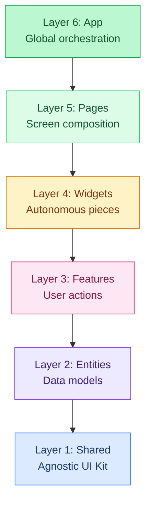

The golden rule: **a module can only import from layers strictly below it.** This eliminates circular dependencies and ensures that changing something in a `feature` does not accidentally break the `shared` layer.

### Atomic Design

Organizes interface components according to their level of complexity and composition. It is the foundation of the design system.

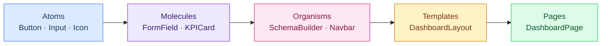

- **Atoms:** The smallest indivisible unit. A `Button` does not know if it is submitting a form or changing a theme; it just executes a function when clicked.
- **Molecules:** Groups of atoms with a simple function. A `FormField` (Label + Input + ErrorText) is a generic molecule. A `FieldTypeTag` (icon + field type label) is a domain molecule.
- **Organisms:** Complex sections. Prismatica's `SchemaBuilder` is an organism that lives in the `widgets` FSD layer.
- **Templates:** Layout structures without real data.
- **Pages:** Templates with real data injected.

---

## 1. Why this architecture

### A. The challenge of polymorphism

Prismatica has three layers of increasing complexity: the user defines **schemas** (collections and fields), creates **polymorphic views** over that data (table, bar chart, KPI, calendar, kanban…), and connects those views to the outside world through **adapters** (REST endpoint, embed script, webhook, CSV export).

A flat architecture would collapse at the first sprint of new features. The fusion of FSD + Atomic Design allows the same view to be an interchangeable organism that can be mounted on a dashboard, embedded in an external website, or exposed as a REST endpoint without duplicating logic.

### B. Linear scalability

FSD scales linearly: each new feature is a new folder, without needing to modify existing ones. The cost of adding feature number 20 is no greater than that of the first. By organizing code by business domain rather than technical type, the team's cognitive load is reduced.

### C. Isolation for small teams

The usual team size is 1 or 2 people. Eventually all 5 may work together. The architecture cannot require constant synchronization to function, but it must scale without friction when the team grows.

FSD imposes explicit module boundaries via the `index.ts` (Public API). A developer working on `view-composer` can refactor internally without breaking what someone else left in `collection-builder`, because the external contract remains stable.

### D. TypeScript Strict as a white-box contract

Prismatica has a specific challenge: the user creates their own tables with fields we do not know in advance. To handle this without errors:

- **[Generics (`<T>`)](https://www.typescriptlang.org/docs/handbook/2/generics.html):** Allow the rendering engine to know what data it is painting without writing specific code for each table. A collection row is defined as `CollectionRow<T>`. When the user defines a "Books" table, `T` becomes `Book`.
- **[Strategy Pattern](https://refactoring.guru/design-patterns/strategy):** Instead of `if (type === 'table') ... else if (type === 'chart')...`, we define a `ViewStrategy` interface. Each view is an independent strategy. Adding a new view type is adding a file that implements the interface — the system accepts it automatically.

### E. Zustand vs Redux: the reasoned choice

[Redux](https://redux.js.org/) is very powerful but introduces a lot of boilerplate and requires wrapping the whole application in complex providers. For Prismatica, [Zustand](https://zustand-demo.pmnd.rs/) covers everything needed with a fraction of the code. It does not use Context, which improves performance. Instead of one large central store, each feature has its own small, focused store. If `authStore` fails, `viewComposerStore` does not even know.

---

## 2. The FSD + Atomic Design fusion

FSD and Atomic Design operate in different dimensions and complement each other without overlap.

The fusion is straightforward: Atomic Design lives *inside* FSD. Generic atoms and molecules go in `shared/ui`. Domain molecules go in `entities/*/ui`. Organisms go in `widgets/` and `features/`. Templates and pages go in `pages/`.

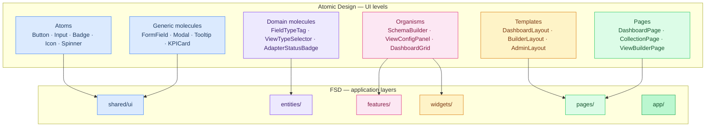

### FSD + Atomic responsibilities table

| FSD Layer | Atomic Design Level | What goes here? | Example in Prismatica |
| :--- | :--- | :--- | :--- |
| **Shared** | Atoms / Molecules | 100% generic UI pieces. | `Button`, `Input`, `Spinner`, `Tooltip`, `KPICard`. |
| **Entities** | Domain molecules | UI that knows a specific data model. | `FieldTypeTag`, `CollectionCard`, `AdapterStatusBadge`. |
| **Features** | Molecules / Organisms | Interaction logic and action components. | `LoginForm`, `CreateCollectionModal`, `ViewFilterPanel`. |
| **Widgets** | Organisms | Large, autonomous, ready-to-use pieces. | `Navbar`, `SchemaBuilder`, `DashboardGrid`, `ViewRenderer`. |
| **Pages** | Templates / Pages | The skeleton and the final screen of the route. | `DashboardPage`, `ViewBuilderPage`, `SettingsPage`. |

### The construction flow

The idea is that the team works from the bottom up:

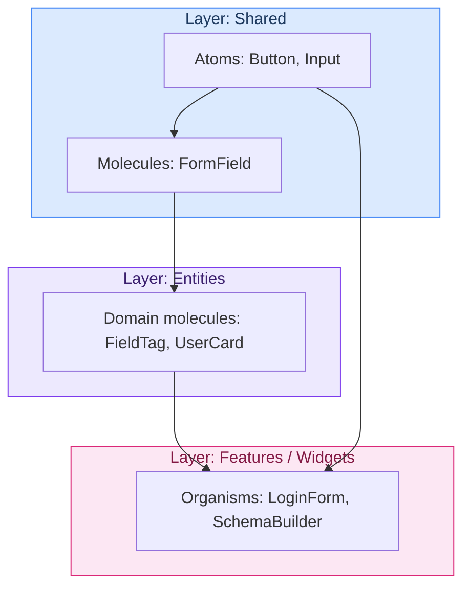

If you need a button, look for it in **Shared**. If you need to display data from a collection, create a molecule in the **Entity** `collection`. If you need the user to be able to edit that collection, create a **Feature** `collection-builder` that uses the previous pieces. Finally, mount that feature in the corresponding **Page**.

The dependency rule in one line: **arrows only point downwards.**

```mermaid
graph LR
    AP["app"] -->|"can import from"| PA["pages"]
    PA -->|"can import from"| WI["widgets"]
    WI -->|"can import from"| FE["features"]
    FE -->|"can import from"| EN["entities"]
    EN -->|"can import from"| SH["shared"]

    style AP fill:#bbf7d0,stroke:#16a34a,color:#14532d
    style PA fill:#dcfce7,stroke:#22c55e,color:#14532d
    style WI fill:#fef3c7,stroke:#d97706,color:#78350f
    style FE fill:#fce7f3,stroke:#db2777,color:#831843
    style EN fill:#ede9fe,stroke:#7c3aed,color:#3b1f6e
    style SH fill:#dbeafe,stroke:#3b82f6,color:#1e3a5f
```

---

## 3. Definitive folder structure

```
apps/frontend/src/
│
├── app/                              # Layer 6 — Providers and global configuration
│   ├── providers/
│   │   ├── AuthProvider.tsx
│   │   ├── ThemeProvider.tsx
│   │   └── QueryProvider.tsx
│   ├── router/
│   │   ├── routes.tsx
│   │   └── guards/
│   │       ├── ProtectedRoute.tsx    # requires active session
│   │       └── RoleGuard.tsx         # user · employee · admin
│   └── styles/
│       └── global.scss
│
├── pages/                            # Layer 5 — Templates + routes (Atomic: Pages)
│   ├── dashboard/
│   │   ├── index.tsx
│   │   └── ui/
│   │       └── DashboardPage.tsx
│   ├── collection/                   # Database Builder
│   ├── view-builder/                 # View configurator
│   ├── adapter/                      # Adapter management
│   ├── admin/                         # Admin space
│   ├── employee/                      # Employee space
│   ├── auth/                         # Login, register, reset
│   └── home/
│
├── widgets/                          # Layer 4 — Autonomous organisms (Atomic: Organisms)
│   ├── schema-builder/               # ER schema drag-and-drop editor
│   │   ├── index.ts                  # Public API — single import point
│   │   ├── ui/
│   │   │   ├── SchemaBuilder.tsx
│   │   │   └── SchemaBuilder.module.scss
│   │   └── model/
│   │       └── useSchemaBuilder.ts
│   ├── view-renderer/                # Polymorphic engine — mounts the view according to its type
│   ├── dashboard-grid/               # 12‑column drag‑and‑drop grid
│   ├── adapter-monitor/               # List of adapters with status and logs
│   └── platform-analytics/            # KPIs and graphs for the admin space
│
├── features/                         # Layer 3 — User interactions (Atomic: Organisms)
│   ├── auth/
│   │   ├── index.ts                  # Public API
│   │   ├── ui/
│   │   │   ├── LoginForm.tsx
│   │   │   ├── RegisterForm.tsx
│   │   │   └── ResetPasswordForm.tsx
│   │   ├── model/
│   │   │   ├── authStore.ts          # Zustand: user · role · token
│   │   │   └── useAuth.ts
│   │   └── api/
│   │       └── authApi.ts
│   ├── collection-builder/           # Create/edit collections and fields
│   ├── view-composer/                 # Configure filters, axes, and view type
│   ├── dashboard-builder/             # Add/move/resize widgets
│   ├── adapter-config/                 # Create and configure adapters
│   ├── user-profile/                   # Edit profile, sessions, GDPR
│   └── public-share/                   # Share dashboards via public link
│
├── entities/                         # Layer 2 — Domain models (Atomic: Molecules)
│   ├── collection/
│   │   ├── index.ts
│   │   ├── model/
│   │   │   └── types.ts              # Collection · Field · FieldType
│   │   ├── ui/
│   │   │   ├── FieldTypeTag.tsx      # Molecule: icon + field type label
│   │   │   └── CollectionCard.tsx    # Molecule: collection summary card
│   │   └── api/
│   │       └── collectionApi.ts
│   ├── view/
│   │   ├── index.ts
│   │   ├── model/
│   │   │   ├── types.ts              # View · ViewType · ViewConfig · ViewStrategy
│   │   │   └── viewStrategyRegistry.ts
│   │   ├── ui/
│   │   │   └── ViewTypeSelector.tsx
│   │   └── api/
│   │       └── viewApi.ts
│   ├── dashboard/
│   ├── adapter/
│   │   ├── index.ts
│   │   ├── model/
│   │   │   └── types.ts              # Adapter · AdapterType · AdapterStatus
│   │   └── ui/
│   │       └── AdapterStatusBadge.tsx
│   ├── project/
│   └── user/
│       ├── index.ts
│       ├── model/
│       │   └── types.ts              # User · UserRole · UserSession
│       └── ui/
│           └── UserRoleBadge.tsx
│
├── shared/                           # Layer 1 — Universal base (Atomic: Atoms + Molecules)
│   ├── ui/
│   │   ├── atoms/
│   │   │   ├── Button/
│   │   │   │   ├── Button.tsx
│   │   │   │   ├── Button.module.scss
│   │   │   │   └── index.ts
│   │   │   ├── Input/
│   │   │   ├── Badge/
│   │   │   ├── Icon/
│   │   │   ├── Spinner/
│   │   │   ├── Avatar/
│   │   │   └── Select/
│   │   ├── molecules/
│   │   │   ├── FormField/
│   │   │   ├── Modal/
│   │   │   ├── Tooltip/
│   │   │   ├── DropdownMenu/
│   │   │   ├── KPICard/
│   │   │   └── DataTable/
│   │   └── index.ts                  # Barrel export of all shared/ui
│   ├── api/
│   │   ├── client.ts                 # axios instance with JWT interceptors
│   │   └── queryClient.ts
│   ├── lib/
│   │   ├── formatters.ts
│   │   ├── validators.ts
│   │   └── cn.ts
│   ├── types/
│   │   └── global.d.ts
│   └── config/
│       └── env.ts
│
└── styles/                           # SCSS — graphical-chart as source of truth
    ├── base/
    │   ├── tokens/
    │   │   ├── _colors.scss          # Palettes and semantic variables
    │   │   ├── _spacing.scss         # 8px scale and 12‑column grid
    │   │   └── _typography.scss      # Font scale and families
    │   ├── _graphical-chart.scss     # Imports all tokens — entry point
    │   └── _reset.scss
    ├── abstracts/
    │   ├── _index.scss               # @forward of tokens + mixins
    │   └── _mixins.scss
    ├── layout/
    │   ├── _app.scss
    │   └── _sidebar.scss
    ├── components/
    └── utilities/
        └── _animations.scss
```

---

## 4. Layer by layer — rules and examples

### 4.1 shared — atoms and molecules

`shared/` is the only layer that **does not know Prismatica's business**. It does not know what a `Collection`, `View`, or `Adapter` is. It is a universal construction kit that could be copied to any other project and would work the same.

**Zero domain rule:** if a component in `shared/ui` imports something from `entities/`, `features/`, or higher layers, it is in the wrong place and will be rejected in code review.

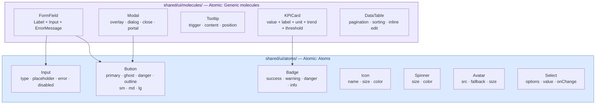

**Why this layer saves time:** when the designer changes the border radius of all buttons in the app, only one token file (`_spacing.scss`) and one component file (`Button.module.scss`) are touched. The rest of the application updates automatically.

**Internal structure of each shared component:**
```
shared/ui/atoms/Button/
├── Button.tsx              # React logic and structure
├── Button.module.scss      # Local styles (Sass Modules)
└── index.ts                # Public API: only exports what is needed
```

**Example — `Button` atom:**

```tsx
// shared/ui/atoms/Button/Button.tsx
import styles from './Button.module.scss'

type ButtonVariant = 'primary' | 'ghost' | 'danger' | 'outline'
type ButtonSize    = 'sm' | 'md' | 'lg'

interface ButtonProps extends React.ButtonHTMLAttributes<HTMLButtonElement> {
  readonly variant?:   ButtonVariant
  readonly size?:      ButtonSize
  readonly isLoading?: boolean
  readonly leftIcon?:  React.ReactNode
}

export function Button({
  variant = 'primary', size = 'md', isLoading = false,
  leftIcon, children, className, disabled, ...rest
}: ButtonProps) {
  return (
    <button
      {...rest}
      disabled={disabled || isLoading}
      className={[
        styles.button,
        styles[`button--${variant}`],
        styles[`button--${size}`],
        isLoading && styles['button--loading'],
        className,
      ].filter(Boolean).join(' ')}
    >
      {isLoading ? <Spinner size="sm" /> : leftIcon}
      {children}
    </button>
  )
}
```

```scss
// shared/ui/atoms/Button/Button.module.scss
// Only tokens from graphical-chart — zero hardcoded values
@use '@/styles/abstracts' as *;

.button {
  display: inline-flex;
  align-items: center;
  gap: $spacing-2;
  border-radius: $radius-md;
  font-family: $font-family-sans;
  font-weight: $font-weight-medium;
  cursor: pointer;
  border: 1px solid transparent;
  transition: background 0.15s ease, opacity 0.15s ease;

  &:focus-visible { @include focus-ring; }
  &:disabled      { opacity: 0.45; cursor: not-allowed; }

  &--primary {
    background: $accent;
    color: $color-on-accent;
    &:hover:not(:disabled) { background: $accent-hover; }
  }
  &--ghost {
    background: transparent;
    color: $accent;
    border-color: $accent;
    &:hover:not(:disabled) { background: rgba($accent, 0.08); }
  }
  &--danger { background: $color-error; color: white; }

  &--sm { padding: $spacing-1 $spacing-3; font-size: $font-size-sm; }
  &--md { padding: $spacing-2 $spacing-4; font-size: $font-size-base; }
  &--lg { padding: $spacing-3 $spacing-6; font-size: $font-size-lg; }
}
```

---

### 4.2 entities — domain models

`entities/` breaks down Prismatica into its base concepts: Collections, Views, Adapters, Projects, and Users. Unlike `shared`, here the code already has business context. They are the pure representation of business objects — without side effects or complex global state.

**Rule:** entities do not manage global state. They can display data, define a type, or make a simple API request. Heavy interaction logic goes in Features.

In Atomic Design they are **Domain molecules**: `FieldTypeTag` knows that the `email` type has a specific icon and color. `AdapterStatusBadge` knows that the `error` status is red.

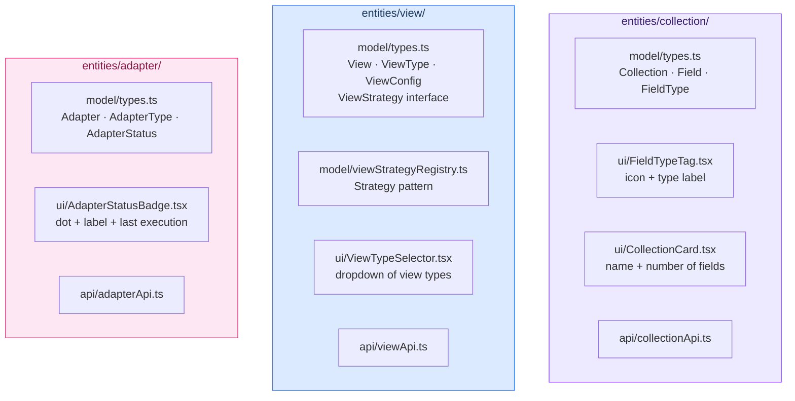

**Example — `view` entity with Strategy pattern:**

The polymorphic contract of Prismatica is defined here. This interface makes the nine view types interchangeable without a single `if/else` in the rendering engine:

```typescript
// entities/view/model/types.ts
export type ViewType =
  | 'table' | 'bar-chart' | 'line-chart' | 'pie-chart'
  | 'kpi'   | 'calendar'  | 'kanban'     | 'scatter'  | 'map'

export type RefreshStrategy = 'manual' | '10s' | '30s' | '1min' | '5min'

export interface ViewConfig {
  readonly id:   string
  readonly type: ViewType
  name:          string
  sourceCollectionId: string
  fieldMappings: FieldMapping[]
  filters:       FilterCondition[]
  refresh:       RefreshStrategy
  visibility:    'private' | 'workspace' | 'public'
  theme:         ViewTheme
}

// Generic for dynamic collection rows — the user defines the schema at runtime
export interface CollectionRow<T = Record<string, unknown>> {
  readonly id: string
  data: T
  readonly metadata: { createdAt: Date; updatedAt: Date; createdBy: string }
}

// Strategy contract — implemented by each view type
export interface ViewStrategy<TConfig extends ViewConfig = ViewConfig> {
  readonly type: ViewType
  validate(config: TConfig): ViewValidationResult
  transform(rows: CollectionRow[], config: TConfig): unknown
  getComponent(): React.ComponentType<ViewRenderProps<TConfig>>
}
```

```typescript
// entities/view/model/viewStrategyRegistry.ts
// Adding a new view = registering a strategy. Zero modifications to the rest.
class ViewStrategyRegistry {
  private readonly strategies = new Map<ViewType, ViewStrategy>()

  register<T extends ViewConfig>(strategy: ViewStrategy<T>): this {
    this.strategies.set(strategy.type, strategy as ViewStrategy)
    return this
  }

  get<T extends ViewConfig>(type: ViewType): ViewStrategy<T> {
    const strategy = this.strategies.get(type)
    if (!strategy) {
      throw new Error(`No strategy registered for view type: "${type}"`)
    }
    return strategy as ViewStrategy<T>
  }
}

export const viewStrategyRegistry = new ViewStrategyRegistry()
```

---

### 4.3 features — user interactions

`features/` contains interaction logic: what the user *does*, not just what they *see*. Each feature is a use case. `collection-builder` manages creating and editing schemas. `view-composer` manages view configuration. `auth` manages the session.

**Silo rule:** a feature can never import anything from another feature. If `dashboard-builder` needs to communicate with `view-composer`, they do it through a shared entity or via events. Features only look down: they import from `entities/` and `shared/`.

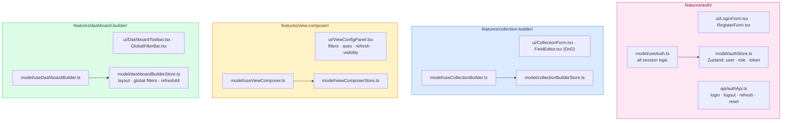

**Example — complete `auth` feature:**

```typescript
// features/auth/model/authStore.ts
import { create } from 'zustand'
import { persist } from 'zustand/middleware'
import type { User, UserRole } from '@/entities/user'

interface AuthState {
  readonly user:        User | null
  readonly role:        UserRole | null
  readonly isLoading:   boolean
  readonly accessToken: string | null
  setUser:    (user: User, role: UserRole, token: string) => void
  clearUser:  () => void
  setLoading: (v: boolean) => void
}

export const useAuthStore = create<AuthState>()(
  persist(
    (set) => ({
      user: null, role: null, isLoading: true, accessToken: null,
      setUser:    (user, role, accessToken) => set({ user, role, accessToken, isLoading: false }),
      clearUser:  () => set({ user: null, role: null, accessToken: null }),
      setLoading: (isLoading) => set({ isLoading }),
    }),
    { name: 'prismatica-auth', partialize: (s) => ({ accessToken: s.accessToken }) }
  )
)
```

```typescript
// features/auth/model/useAuth.ts
import { useCallback }  from 'react'
import { useNavigate }  from 'react-router-dom'
import { useAuthStore } from './authStore'
import { authApi }      from '../api/authApi'

export function useAuth() {
  const navigate = useNavigate()
  const { user, role, isLoading, setUser, clearUser } = useAuthStore()

  const login = useCallback(async (email: string, password: string) => {
    const { user: u, role: r, token } = await authApi.login(email, password)
    setUser(u, r, token)
    navigate(r === 'admin' ? '/admin' : r === 'employee' ? '/employee' : '/dashboard')
  }, [setUser, navigate])

  const logout = useCallback(async () => {
    await authApi.logout()
    clearUser()
    navigate('/login')
  }, [clearUser, navigate])

  return {
    user, role,
    isAuthenticated: user !== null,
    isAdmin:         role === 'admin',
    isEmployee:      role === 'employee' || role === 'admin',
    isLoading, login, logout,
  } as const
}

// features/auth/index.ts — Public API
export { useAuth }           from './model/useAuth'
export { useAuthStore }      from './model/authStore'
export { LoginForm }         from './ui/LoginForm'
export { RegisterForm }      from './ui/RegisterForm'
export { ResetPasswordForm } from './ui/ResetPasswordForm'
```

---

### 4.4 widgets — complex organisms

`widgets/` contains the autonomous organisms of Prismatica: large, self‑contained pieces that combine features and entities to deliver a complete use case. A widget should be able to be dropped into any page and work on its own.

**Rule:** a widget can import from `features/`, `entities/`, and `shared/`. It cannot import from `pages/`. It cannot import from another widget. If two widgets need to share something, that logic moves down to a `feature` or `entity`.

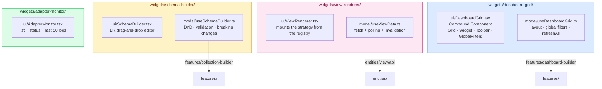

**Example — `ViewRenderer` with Strategy:**

```tsx
// widgets/view-renderer/ui/ViewRenderer.tsx
import { Suspense }             from 'react'
import { viewStrategyRegistry } from '@/entities/view'
import { useViewData }          from '../model/useViewData'
import type { ViewConfig }      from '@/entities/view'
import styles from './ViewRenderer.module.scss'

interface ViewRendererProps {
  viewId:   string
  config:   ViewConfig
  isEmbed?: boolean
}

export function ViewRenderer({ viewId, config, isEmbed = false }: ViewRendererProps) {
  const strategy = viewStrategyRegistry.get(config.type)
  const { data, isLoading, error } = useViewData(viewId, config)

  if (error)               return <ViewErrorState message={error.message} />
  if (!data && !isLoading) return <ViewEmptyState />

  const ViewComponent   = strategy.getComponent()   // React.lazy — automatic code splitting
  const transformedData = data ? strategy.transform(data, config) : null

  return (
    <div className={[styles.renderer, isEmbed && styles['renderer--embed']].filter(Boolean).join(' ')}>
      <Suspense fallback={<ViewSkeleton type={config.type} />}>
        <ViewComponent config={config} data={transformedData} isLoading={isLoading} />
      </Suspense>
    </div>
  )
}
```

**Example — `DashboardGrid` with Compound Components:**

```tsx
// widgets/dashboard-grid/ui/DashboardGrid.tsx
import { createContext, useContext, useMemo } from 'react'
import { useDashboardBuilder } from '@/features/dashboard-builder'
import type { Dashboard }      from '@/entities/dashboard'

interface DashboardGridContextValue {
  readonly dashboardId:   string
  readonly globalFilters: GlobalFilter[]
  readonly isRefreshing:  boolean
  setGlobalFilter:   (fieldId: string, value: unknown) => void
  triggerRefreshAll: () => void
}

const DashboardGridContext = createContext<DashboardGridContextValue | null>(null)

export function useDashboardGridContext() {
  const ctx = useContext(DashboardGridContext)
  if (!ctx) throw new Error('Must be used inside <DashboardGrid>')
  return ctx
}

function DashboardGrid({ config, children }: { config: Dashboard; children?: React.ReactNode }) {
  const { globalFilters, isRefreshing, setGlobalFilter, triggerRefreshAll } =
    useDashboardBuilder(config.id)

  const ctx = useMemo(() => ({
    dashboardId: config.id, globalFilters, isRefreshing, setGlobalFilter, triggerRefreshAll,
  }), [config.id, globalFilters, isRefreshing, setGlobalFilter, triggerRefreshAll])

  return (
    <DashboardGridContext.Provider value={ctx}>
      <div className={styles.grid}>
        {children ?? <DashboardGrid.DefaultLayout config={config} />}
      </div>
    </DashboardGridContext.Provider>
  )
}

function DashboardWidget({ viewId, config }: { viewId: string; config: ViewConfig }) {
  const { globalFilters, isRefreshing } = useDashboardGridContext()
  const applicableFilters = globalFilters.filter(f => f.appliesTo.includes(viewId))

  return (
    <div className={styles.widget} data-view-id={viewId}>
      <ViewRenderer viewId={viewId} config={{ ...config, filters: [...config.filters, ...applicableFilters] }} />
    </div>
  )
}

DashboardGrid.Widget        = DashboardWidget
DashboardGrid.Toolbar       = DashboardToolbar
DashboardGrid.GlobalFilters = DashboardGlobalFilters
DashboardGrid.RefreshButton = DashboardRefreshButton

export { DashboardGrid }
```

---

### 4.5 pages — templates + routes

`pages/` assembles the complete screen. It has no business logic of its own: its only responsibility is layout and composition of the correct pieces.

**Rule:** if a page exceeds 50 lines of logic, something that should be in a widget or feature is in the page. The page is glue, not brain.

```tsx
// pages/dashboard/ui/DashboardPage.tsx
import { DashboardGrid } from '@/widgets/dashboard-grid'
import { RoleGuard }     from '@/app/router/guards/RoleGuard'
import { useDashboard }  from '@/entities/dashboard'
import { useParams }     from 'react-router-dom'
import styles from './DashboardPage.module.scss'

export function DashboardPage() {
  const { dashboardId } = useParams<{ dashboardId: string }>()
  const { data: dashboard, isLoading } = useDashboard(dashboardId!)

  if (isLoading)  return <DashboardSkeleton />
  if (!dashboard) return <NotFound />

  return (
    <RoleGuard roles={['user', 'employee', 'admin']}>
      <div className={styles.layout}>
        <main className={styles.main}>
          <DashboardGrid config={dashboard}>
            <DashboardGrid.Toolbar />
            <DashboardGrid.GlobalFilters />
            {dashboard.widgets.map(w => (
              <DashboardGrid.Widget key={w.viewId} viewId={w.viewId} config={w.viewConfig} />
            ))}
          </DashboardGrid>
        </main>
      </div>
    </RoleGuard>
  )
}
```

---

### 4.6 app — providers and global configuration

`app/` is the entry point. It mounts global providers, the router, and base styles. It contains no business logic. Its most important mission for Prismatica is the **registration of view strategies** before the first component is painted.

```tsx
// app/App.tsx
import { QueryProvider } from './providers/QueryProvider'
import { AuthProvider }  from './providers/AuthProvider'
import { ThemeProvider } from './providers/ThemeProvider'
import { AppRouter }     from './router/routes'
import { viewStrategyRegistry } from '@/entities/view'
import { BarChartStrategy, TableStrategy, KPIStrategy,
         LineChartStrategy, CalendarStrategy, KanbanStrategy,
         PieChartStrategy, ScatterStrategy } from '@/features/view-composer/strategies'
import './styles/global.scss'

viewStrategyRegistry
  .register(new TableStrategy())
  .register(new BarChartStrategy())
  .register(new LineChartStrategy())
  .register(new KPIStrategy())
  .register(new CalendarStrategy())
  .register(new KanbanStrategy())
  .register(new PieChartStrategy())
  .register(new ScatterStrategy())

export function App() {
  return (
    <QueryProvider>
      <AuthProvider>
        <ThemeProvider>
          <AppRouter />
        </ThemeProvider>
      </AuthProvider>
    </QueryProvider>
  )
}
```

---

## 5. Public API — the golden rule of the slice

Every folder with an `index.ts` is a black box. Only what is explicitly exported in that `index.ts` can be imported. Importing from an internal path is an architectural violation.

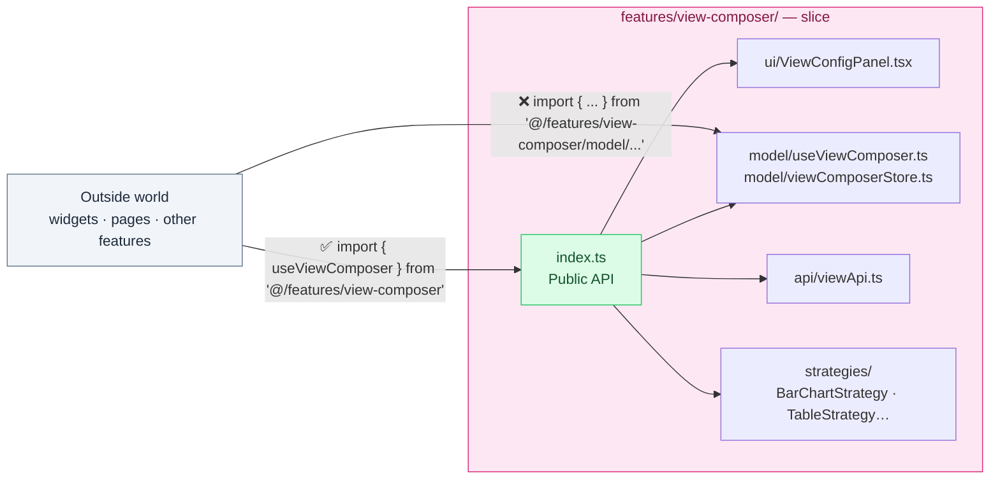

```typescript
// ❌ BAD — coupling to internal structure
import { useAuth }   from '@/features/auth/model/useAuth'
import { LoginForm } from '@/features/auth/ui/LoginForm'

// ✅ GOOD — only through the Public API
import { useAuth, LoginForm } from '@/features/auth'
```

**Why it is vital for a small team:** when one person refactors the internals of `collection-builder` — moves files, renames hooks, changes structure — they do not break the work of someone who uses `collection-builder` from a widget, because the `index.ts` still exports the same contract.

---

## 6. TypeScript Strict — contracts between layers

[TypeScript Strict](https://www.typescriptlang.org/tsconfig#strict) acts as an automatic guardian. The goal is that any violation of the contract between layers is a compilation error, not a bug in production.

**Steel rules for the team:**
1. `strict: true` throughout the project — no exceptions.
2. `any` is forbidden — use `unknown` with type guards.
3. `interface` for objects, `type` for unions and simple aliases.
4. `readonly` by default for data coming from the API.

**Shared types in `packages/shared/src/types/`** — used by both frontend and NestJS backend:

```typescript
// packages/shared/src/types/collection.ts
export type FieldType =
  | 'text' | 'number' | 'boolean' | 'date' | 'datetime'
  | 'email' | 'url' | 'select' | 'relation' | 'file' | 'computed'

export interface Field {
  readonly id: string     // ID cannot be changed once created
  name:    string
  label:   string
  type:    FieldType
  required:     boolean
  defaultValue?: unknown
  validation:   ValidationRule[]
}

export interface Collection {
  readonly id:   string
  name:    string
  fields:  Field[]
  softDelete:  boolean
  auditTrail:  boolean
  readonly createdAt: Date
}

// packages/shared/src/types/adapter.ts
export type AdapterType =
  | 'embed-script' | 'rest-endpoint' | 'webhook'
  | 'csv-export'   | 'rest-write'    | 'form-endpoint'

export type AdapterStatus = 'active' | 'error' | 'paused'

export interface Adapter {
  readonly id:   string
  readonly type: AdapterType
  status:  AdapterStatus
  viewId?: string
  collectionId?: string
  config:  Record<string, unknown>
  readonly lastRunAt?:     Date
  readonly lastRunStatus?: 'success' | 'error'
}
```

**The immediate effect:** if someone changes a field in the backend (NestJS), TypeScript makes the frontend fail to compile, forcing it to be fixed before pushing. Types are not written twice.

---

## 7. SCSS — graphical-chart + CSS Modules

Two principles with no exceptions:

**Principle 1 — `_graphical-chart.scss` is the only source of truth.** No color, spacing, typography, or breakpoint exists as a literal value outside that file.

**Principle 2 — Component styles live in [CSS Modules](https://github.com/css-modules/css-modules) next to the component.** `SchemaBuilder.module.scss` next to `SchemaBuilder.tsx`. Never global styles that affect components by class name.

The graphical chart is split into tokens to avoid it being an unreadable monolith:

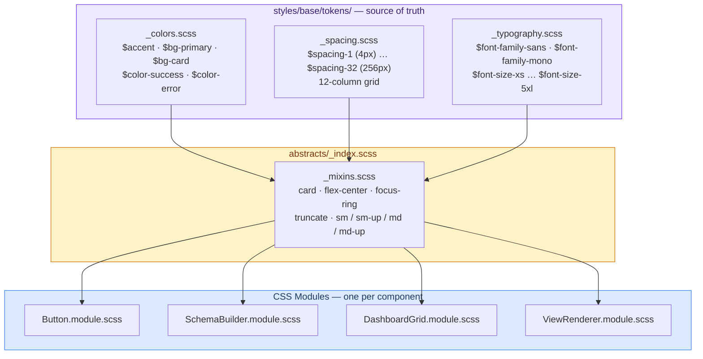

**The golden rule — locked in code review:**

```scss
// ❌ BAD — hardcoded
.schema-panel {
  background: #1a1a2e;
  padding: 16px 24px;
  border-radius: 8px;
  font-family: 'Inter', sans-serif;
}

// ✅ GOOD — tokens from graphical-chart
@use '@/styles/abstracts' as *;

.schema-panel {
  background: $bg-card;
  padding: $spacing-4 $spacing-6;
  border-radius: $radius-md;
  font-family: $font-family-sans;

  @include md { padding: $spacing-3 $spacing-4; }
}
```

---

## 8. State management — Zustand per slice

Each feature that needs global state has its own [Zustand](https://zustand-demo.pmnd.rs/) store, placed inside the slice. There is no monolithic store. Stores are small and focused: if `collectionBuilderStore` fails, `authStore` does not even know.

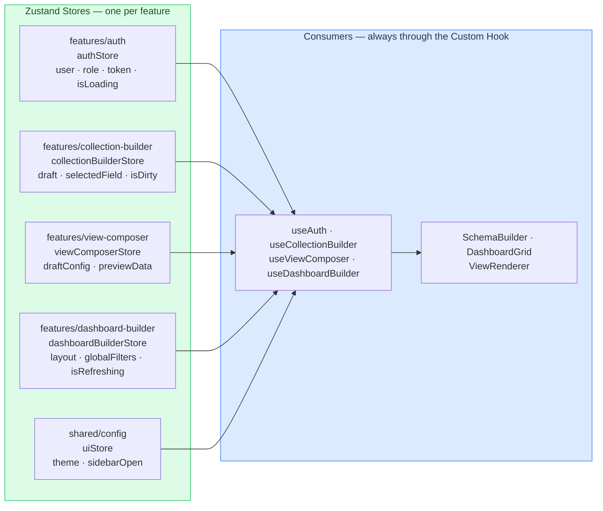

**Rule:** components never access the store directly. Always through the slice's Custom Hook:

```typescript
// ✅ GOOD
import { useCollectionBuilder } from '@/features/collection-builder'
function FieldEditor() {
  const { draft, addField, removeField } = useCollectionBuilder()
}

// ❌ BAD — direct coupling to the store
import { useCollectionBuilderStore } from '@/features/collection-builder/model/collectionBuilderStore'
function FieldEditor() {
  const { draft, setDraft } = useCollectionBuilderStore()
}
```

---

## 9. Complete data flow

Data in Prismatica always follows the same path. No one skips steps. This makes debugging predictable.

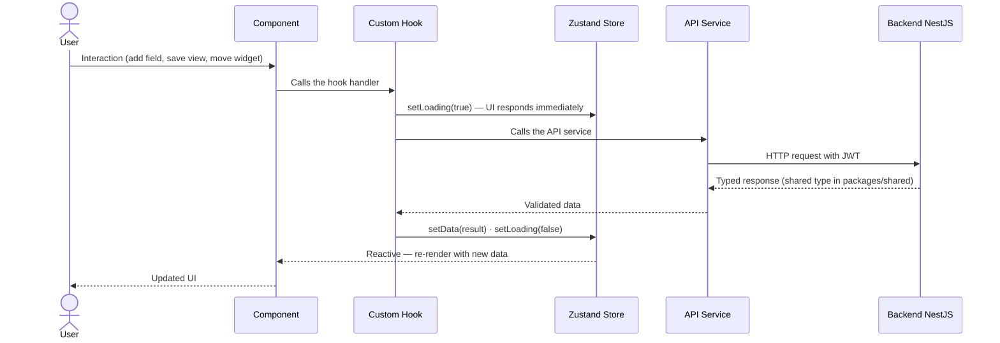

**Ultra‑fast debugging by station:**
- Does the web not react to the click? → Failure in the **Component** or **Hook**.
- Does the loading spinner not appear? → Failure in the **Store** call inside the Hook.
- Does the data not reach the server? → Failure in the **API Service**.
- Does the server respond but the web not update? → Failure in how the Hook updates the **Store**.

---

## 10. How to add a new feature

The process is designed so that one person can add a complete feature without modifying any existing file. Completely additive.

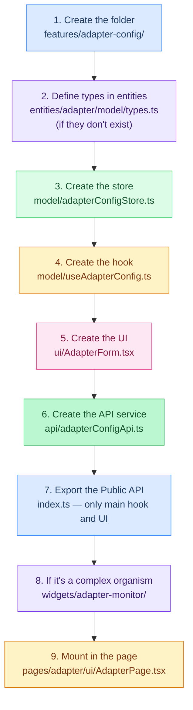

What **does not** happen: no existing file in `auth`, `collection-builder`, `view-composer`, or any previous widget is modified. When the team grows from 1 to 5 people, each works in their own slice without risk of structural conflict.

---

## 11. Applied React patterns

### Custom Hooks — separation of logic/presentation

Components are "dumb": they only know how to render. All intelligence (state, effects, API calls) lives in Custom Hooks. If how a form is validated changes, the UI is not touched, only the hook.

### Strategy + Registry — the polymorphic contract

Each view type implements `ViewStrategy`. The `ViewRenderer` consults the registry and mounts the correct strategy. Adding a new view type is adding a file and registering it in `app/App.tsx` — zero modifications to the rendering engine.

### Compound Components — organisms with shared state

For complex organisms like `DashboardGrid` where multiple subcomponents share state without prop drilling. The state lives in the root component and is distributed via internal Context to the widget. Expressive syntax: `<DashboardGrid.Widget />`.

### Early Return — clean conditional rendering

Nested ternaries are forbidden. Special states are handled with early returns at the beginning of the function:

```tsx
export function CollectionPage({ collectionId }: { collectionId: string }) {
  const { data, isLoading, error } = useCollection(collectionId)

  if (isLoading) return <CollectionSkeleton />
  if (error)     return <ErrorState message={error.message} />
  if (!data)     return <NotFound />

  return <CollectionContent collection={data} />
}
```

### Lazy Loading — automatic bundle splitting

```tsx
// app/router/routes.tsx
const DashboardPage   = React.lazy(() => import('@/pages/dashboard'))
const CollectionPage  = React.lazy(() => import('@/pages/collection'))
const ViewBuilderPage = React.lazy(() => import('@/pages/view-builder'))
const AdapterPage     = React.lazy(() => import('@/pages/adapter'))
const AdminPage       = React.lazy(() => import('@/pages/admin'))
```

---

## 12. Testing & TDD — The safety net

This section is **non‑negotiable**. In Prismatica, no production code is written without a test to back it up.

### The TDD cycle: Red → Green → Refactor

[Test-Driven Development (TDD)](https://en.wikipedia.org/wiki/Test-driven_development) is not "writing tests at the end". It is a three‑step cycle repeated for each unit of logic:

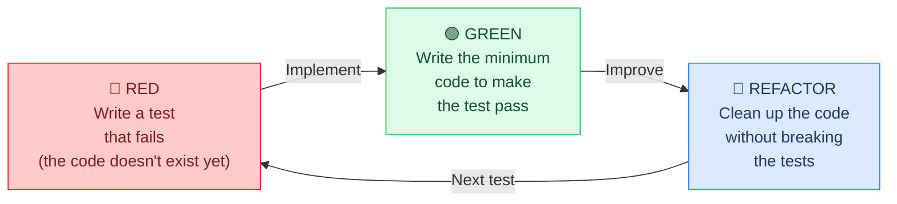

**Why it's mandatory in Prismatica:** the polymorphic system (nine view types, six adapter types, dynamic schemas) has too many possible combinations to test manually. Tests are the only guarantee that adding a new view type does not break existing ones.

### Where tests live in FSD

Following the "autonomous islands" rule, tests are not in a distant folder but **next to the code they test**:

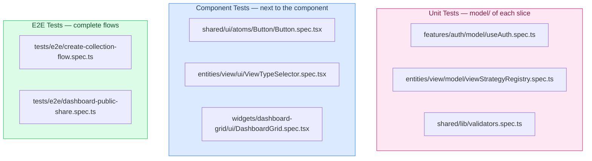

### The test pyramid

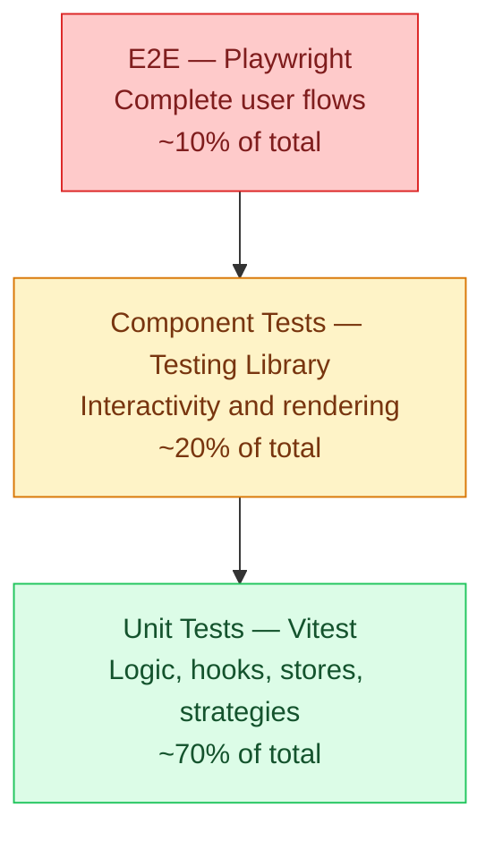

### Applying TDD in Prismatica's core domains

#### 1. Database Builder — Protect schema integrity

The risk: the user deletes a field that is being used in an active view, breaking data visualization.

**TDD cycle:**

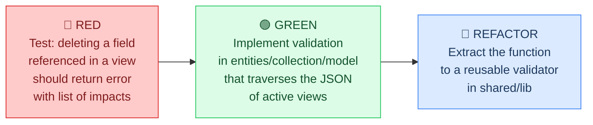

```typescript
// entities/collection/model/schemaValidator.spec.ts

describe('validateFieldDeletion', () => {
  it('🔴 should block deletion if the field is referenced in an active view', () => {
    const field: Field = { id: 'field-1', name: 'status', type: 'select', required: true, validation: [] }
    const activeViews: ViewConfig[] = [
      { id: 'view-1', type: 'kanban', sourceCollectionId: 'col-1',
        fieldMappings: [{ fieldId: 'field-1', role: 'status' }],
        filters: [], refresh: 'manual', visibility: 'private', theme: {} }
    ]

    const result = validateFieldDeletion(field, activeViews)

    expect(result.canDelete).toBe(false)
    expect(result.blockedBy).toHaveLength(1)
    expect(result.blockedBy[0].viewId).toBe('view-1')
    expect(result.blockedBy[0].reason).toContain('status')
  })

  it('🟢 should allow deletion if the field is not referenced in any view', () => {
    const field: Field = { id: 'field-2', name: 'notes', type: 'text', required: false, validation: [] }
    const result = validateFieldDeletion(field, [])
    expect(result.canDelete).toBe(true)
    expect(result.blockedBy).toHaveLength(0)
  })
})
```

#### 2. Polymorphic Views — Verify the contract of each strategy

The risk: adding a new view type that does not fulfill the `ViewStrategy` contract, causing a silent crash in the `ViewRenderer`.

**TDD cycle:**

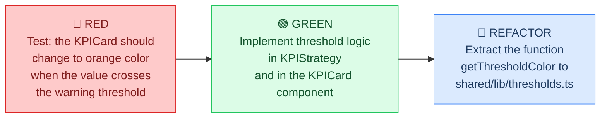

```typescript
// entities/view/model/viewStrategyRegistry.spec.ts

describe('ViewStrategyRegistry', () => {
  it('should throw error if an unregistered view type is requested', () => {
    const registry = new ViewStrategyRegistry()
    expect(() => registry.get('map')).toThrowError(
      'No strategy registered for view type: "map"'
    )
  })

  it('should return the correct strategy after registration', () => {
    const registry = new ViewStrategyRegistry()
    const mockStrategy = { type: 'table' as ViewType, validate: vi.fn(), transform: vi.fn(), getComponent: vi.fn() }
    registry.register(mockStrategy)
    expect(registry.get('table')).toBe(mockStrategy)
  })
})

// shared/ui/molecules/KPICard/KPICard.spec.tsx
import { render, screen } from '@testing-library/react'

describe('KPICard — threshold colors', () => {
  it('🔴 shows warning color when value exceeds the threshold', () => {
    render(<KPICard label="Sales" value={85} threshold="warning" />)
    const card = screen.getByRole('article')
    expect(card).toHaveClass('kpi-card--warning')
  })

  it('shows success color when value is within range', () => {
    render(<KPICard label="Sales" value={45} threshold="success" />)
    expect(screen.getByRole('article')).toHaveClass('kpi-card--success')
  })

  it('shows danger color when value exceeds critical threshold', () => {
    render(<KPICard label="Sales" value={120} threshold="danger" />)
    expect(screen.getByRole('article')).toHaveClass('kpi-card--danger')
  })
})
```

#### 3. Dashboard Builder — Persistence and behavior

The risk: the autosave debounce does not work correctly, losing layout changes.

**TDD cycle:**

```typescript
// widgets/dashboard-grid/model/useDashboardGrid.spec.ts
import { renderHook, act } from '@testing-library/react'
import { vi } from 'vitest'

describe('useDashboardGrid — autosave with debounce', () => {
  beforeEach(() => { vi.useFakeTimers() })
  afterEach(() => { vi.useRealTimers() })

  it('🔴 does not save immediately when moving a widget', async () => {
    const saveMock = vi.fn()
    const { result } = renderHook(() => useDashboardGrid('dashboard-1', saveMock))

    act(() => { result.current.moveWidget('widget-a', { x: 2, y: 0, w: 4, h: 3 }) })

    expect(saveMock).not.toHaveBeenCalled()
  })

  it('🟢 saves exactly after 2 seconds of inactivity', async () => {
    const saveMock = vi.fn()
    const { result } = renderHook(() => useDashboardGrid('dashboard-1', saveMock))

    act(() => { result.current.moveWidget('widget-a', { x: 2, y: 0, w: 4, h: 3 }) })
    act(() => { vi.advanceTimersByTime(2000) })

    expect(saveMock).toHaveBeenCalledTimes(1)
  })

  it('resets the timer if another move happens before 2 seconds', async () => {
    const saveMock = vi.fn()
    const { result } = renderHook(() => useDashboardGrid('dashboard-1', saveMock))

    act(() => { result.current.moveWidget('widget-a', { x: 2, y: 0, w: 4, h: 3 }) })
    act(() => { vi.advanceTimersByTime(1000) })
    act(() => { result.current.moveWidget('widget-b', { x: 6, y: 0, w: 6, h: 3 }) })
    act(() => { vi.advanceTimersByTime(1999) })

    expect(saveMock).not.toHaveBeenCalled()

    act(() => { vi.advanceTimersByTime(1) })
    expect(saveMock).toHaveBeenCalledTimes(1)
  })
})
```

#### 4. Adapters and Embed — Style isolation

The risk: the script embedded in an external site breaks the host's styles or its own styles are affected by the host.

```typescript
// widgets/view-renderer/ui/ViewRenderer.spec.tsx
import { render } from '@testing-library/react'
import { axe, toHaveNoViolations } from 'jest-axe'

expect.extend(toHaveNoViolations)

describe('ViewRenderer — WCAG 2.1 AA accessibility', () => {
  it('has no accessibility violations detectable by jest-axe', async () => {
    const { container } = render(
      <ViewRenderer
        viewId="view-1"
        config={{ id: 'view-1', type: 'table', name: 'Test', sourceCollectionId: 'col-1',
                  fieldMappings: [], filters: [], refresh: 'manual',
                  visibility: 'public', theme: {} }}
      />
    )
    const results = await axe(container)
    expect(results).toHaveNoViolations()
  })
})

describe('ViewRenderer — embed mode', () => {
  it('applies the embed class when isEmbed is true', () => {
    const { container } = render(
      <ViewRenderer viewId="v1" config={mockConfig} isEmbed={true} />
    )
    expect(container.firstChild).toHaveClass('renderer--embed')
  })
})
```

### Toolbox

| Test type | Tool | Goal in Prismatica |
| :--- | :--- | :--- |
| **Unit** | **[Vitest](https://vitest.dev/)** | Validate schema rules, KPI calculations, filter logic, the Strategy Registry. |
| **Component** | **[Testing Library](https://testing-library.com/)** | Test the interactivity of views, modals, forms, and drag‑and‑drop. |
| **E2E** | **[Playwright](https://playwright.dev/)** | Simulate the complete flow: Create collection → Create view → See in dashboard. |
| **Accessibility** | **[jest-axe](https://github.com/nickcolley/jest-axe)** | Ensure [WCAG 2.1 AA](https://www.w3.org/WAI/WCAG21/quickref/?currentsidebar=%23col_customize&levels=aaa) compliance across the platform. |

### The 100% green rule

The CI pipeline ([GitHub Actions](https://github.com/features/actions)) **blocks any Pull Request that does not pass all tests**. No exceptions. Polymorphic code demands universal tests: if the `ViewRenderer` works for `bar-chart`, it must work for `map` with the same guarantees.

---

## 13. Discarded patterns and why

### Flat structure without FSD (`components/` without layers)

The structure `components/`, `hooks/`, `stores/`, `services/` is a valid starting point for very small projects. For Prismatica, with six differentiated business domains (collections, views, dashboards, adapters, authentication, administration), that structure produces a `components/` folder of 40+ files with no signal about what depends on what. FSD does not erase that structure: it organizes it. Generic `components/` move to `shared/ui/atoms/` and `molecules/`. Domain components move to `entities/*/ui/`. Logic components move to `features/*/ui/`.

### Redux Toolkit

[RTK](https://redux-toolkit.js.org/) is the right choice when there are more than ten features modifying the same global state, time‑travel debugging is needed, or the team exceeds ten people in the same domain. Prismatica has state well separated by domain. One Zustand store per feature — 20 lines — covers everything needed with zero boilerplate. If the project scales, migration to RTK is natural because the store separation is already done.

### CSS-in-JS (Styled Components, Emotion)

The project already has a defined style architecture with `_graphical-chart.scss` as source of truth. [CSS-in-JS](https://css-tricks.com/a-thorough-analysis-of-css-in-js/) introduces a second parallel system, runtime overhead on every render, and makes it impossible to maintain the graphical‑chart rule because design values would end up as strings in JavaScript. CSS Modules with SCSS tokens offer total encapsulation, zero runtime overhead, and full compatibility with the existing token system.

### Higher-Order Components

[HOCs](https://reactjs.org/docs/higher-order-components.html) are opaque in React DevTools, complicate type inference in TypeScript Strict, and are directly replaced by Custom Hooks in all use cases of the project. `withAuth(Component)` becomes `useAuth()` inside the component, with better DX and clearer types.

### Micro-Frontends

For a usual team of 1‑2 people with a monorepo and a docker‑compose, the operational complexity of [Module Federation](https://module-federation.io/) is unjustified. FSD provides the same level of module independence with 10% of the complexity. If the project scales to multiple teams with independent deployment cycles, migration from FSD is straightforward because the slices are already self‑contained modules with an explicit Public API.

---

*Reference document — Prismatica · ft_transcendence · Univers42, 2026*
*Commit conventions, git flow and detailed SCSS: [CONTRIBUTING.md](CONTRIBUTING.md)*
*Full stack and general architecture: [README.md](README.md)*